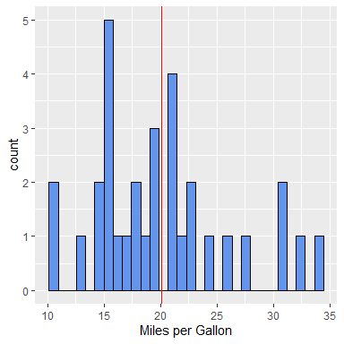
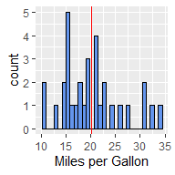
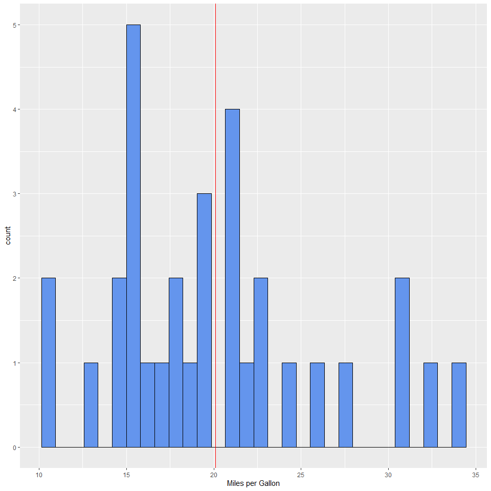
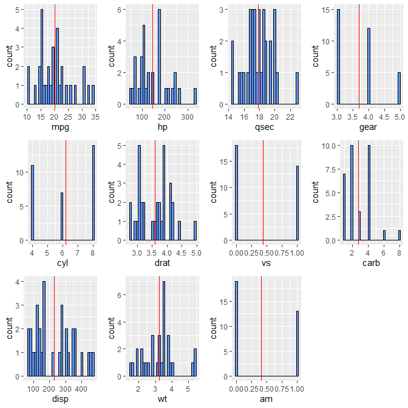

<!--BEGIN:  Set the global options and load packages-->


<!--END:  Set the global options and load packages-->


******************************************************************************************

# Welcome!


This workshop was hosted on **May 11th, 2016** and has 2 supplemental materials available:   

1. **Class notes** can be found on the workshop <a href="http://pad.software-carpentry.org/2016-05-11-RMarkdown" target="_blank">etherpad</a>.  
2. This workshop was **recorded** live and is available on <a href="http://youtu.be/WFAHJ0NHOEQ" target="_blank">YouTube</a>.  Please be welcome to tune in on YouTube!  
This tutorial was constructed as a part of Dr. C Titus Brown's <a href="http://dib-training.readthedocs.io/en/pub/index.html" target="_blank">Data Intensive Biology (DIB)</a> training program at the University of California, Davis.  The DIB training program hosts local + remote workshops covering topics in bioinformatic tools and data analysis.
There were three remote classrooms that tuned in:  
1. University of California, Davis  
2. Simon Fraser University
3. Ontario Institute for Cancer Research
The **Github repository** for this lesson can <a href="https://github.com/marschmi/RMarkdown_May11_2016" target="_blank">be found here</a>.  
******************************************************************************************
## Installation Instructions  
**Before working through the workshop materials, please do the following in preparation:**
1. Open up **RStudio**.  
2. Install and download the **devtools** R package by running the following in the R console. 

```r
install.packages("devtools") # To include the session information
library("devtools") # To include the session information  
```
3. Check that you have the correct versions of **R** and **RStudio** by running `devtools::session_info()` in the R console.  
Here, `devtools::` tells **R** to use the `session_info()` function within the **devtools** package rather than the `sessionInfo()` function within the **utils** package.  Running `devtools::session_info()` allows us to see the version of **R** and **RStudio**. 
Do you have the following versions of **R** and **RStudio**?  
- **R:** `Version 3.3.0 (2016-05-03)`  
- **RStudio:** `0.99.1172`  
  - If you **do** then you are good to go!  
  - If you **do not** have the correct versions of **R** and **RStudio**, please follow the 
<a href="http://umswc.github.io/2016-05-11-RMarkdown/" target="_blank">Setup</a> directions on our course page.  
4. Install other R packages necessary for the workshop.

```r
## Install the correct packages
install.packages("rmarkdown") # Make cool dynamic documents
install.packages("knitr") # Run R Code Chunks
install.packages("ggplot2") # For plotting
install.packages("DT") # Interactive HTML tables
```

```r
## Add these packages to the current session to make sure they load correctly
library("rmarkdown") # Make cool dynamic documents
library("knitr") # Run R Code Chunks
library("ggplot2") # For plotting
library("DT") # Interactive HTML tables
```
5. If your packages loaded without any errors, then you are ready for the workshop!  
If there were issues with the above packages please place a pink sticky to get help from a helper!
******************************************************************************************
# Amazing Resources
I could **not** have made this tutorial without these amazing resources:  
1. The <a href="http://rmarkdown.rstudio.com/index.html" target="_blank">RMarkdown</a> website hosted by RStudio.  
2. Dr. Yuhui Xie's book:  <a href="http://www.amazon.com/Dynamic-Documents-knitr-Chapman-Hall/dp/1482203537" target="_blank">Dynamic Documents with R and Knitr</a> 2^nd^ Edition [@Xie2015] and his <a href="http://yihui.name/knitr/" target="_blank">Knitr</a> website.  
    - A **BIG thank you** to Dr. Xie for writing the **Knitr** Package!!  
3. Dr. Karl Broman's <a href="http://kbroman.org/knitr_knutshell/" target="_blank">"Knitr in a Knutshell"</a>.  
4. <a href="https://www.rstudio.com/resources/cheatsheets/" target="_blank">Cheatsheets</a> released by RStudio.
******************************************************************************************
# Dynamic Documents  
<a href="https://en.wikipedia.org/wiki/Literate_programming">Literate programming</a> is the basic idea behind dynamic documents and was proposed by Donald Knuth in 1984.  Originally, it was for mixing the source code and documentation of software development together.  Today, we will create dynamic documents in which program or analysis code is run to produce output (e.g. tables, plots, models, etc) and then are explained through narrative writing.
The 3 steps of **Literate Programming**:  
1. **Parse** the source document and separate code from narratives.  
2. **Execute** source code and return results.  
3. **Mix** results from the source code with the original narratives.  
So that leaves 2 steps for us which includes writing:  
1. Analysis code  
2. A narrative to explain the results from the analysis code.  
Traditionally, people used comments to include narrative in their code file (for **R** that would be a `.R` file). For example, the file may include the following:

```r
# Title:  Relationship of Car Weight and Gas Efficiency 
# By:  Marian Schmidt  
# Date:  May 11th, 2016
# I predict that there will be a relationship between weight and miles per gallon.  
# I will test this by running a linear model with the mtcars dataset is within the R datasets
# What does the data look like?
datatable(mtcars) # Interactive table 
# Is there a relationship between the weight of a car and the miles per gallon?
lm_mpg <- lm(mpg ~ wt, data = mtcars) # Run linear model predicting mpg based on wt
coef_lm_mpg <- coef(summary(lm_mpg)) # Extract coefficients to table 
kable(coef_lm_mpg) # Produce non-interactive table - function in knitr
# Plot the relationship between weight and miles per gallon  
plot <- ggplot(mtcars, aes(x = wt, y = mpg)) + geom_point() + # 
  geom_smooth(method = "lm") + theme_bw() + # add linear model and make black and white
  xlab("Weight (1000lbs)") + ylab("Miles per Gallon") # Add axis labels
ggplotly(plot) # Make the plot interactive  
# It appears that with a gain in every 1000 pounds that there will be a decrease in fuel efficiency by 5.34 miles per gallon
# The end
```
Then the user would have to read the comments and run the code themselves.  
However, literate programming allows us to run the code and describe the code all within one document that we could share.  So for example we could do the following:  
***
**Relationship of Car Weight and Gas Efficiency**  
*By:* Marian Schmidt  
*Date:* May 11th, 2016  
I predict that there will be a relationship between weight and miles per gallon.  
I will test this by running a linear model with the mtcars dataset is within the R data sets.

```r
# What does the data look like?
datatable(mtcars) # Interactive table 
```

<!--html_preserve--><div id="htmlwidget-0bd7072f654574e485fb" style="width:100%;height:auto;" class="datatables html-widget"></div>
<script type="application/json" data-for="htmlwidget-0bd7072f654574e485fb">{"x":{"filter":"none","data":[["Mazda RX4","Mazda RX4 Wag","Datsun 710","Hornet 4 Drive","Hornet Sportabout","Valiant","Duster 360","Merc 240D","Merc 230","Merc 280","Merc 280C","Merc 450SE","Merc 450SL","Merc 450SLC","Cadillac Fleetwood","Lincoln Continental","Chrysler Imperial","Fiat 128","Honda Civic","Toyota Corolla","Toyota Corona","Dodge Challenger","AMC Javelin","Camaro Z28","Pontiac Firebird","Fiat X1-9","Porsche 914-2","Lotus Europa","Ford Pantera L","Ferrari Dino","Maserati Bora","Volvo 142E"],[21,21,22.8,21.4,18.7,18.1,14.3,24.4,22.8,19.2,17.8,16.4,17.3,15.2,10.4,10.4,14.7,32.4,30.4,33.9,21.5,15.5,15.2,13.3,19.2,27.3,26,30.4,15.8,19.7,15,21.4],[6,6,4,6,8,6,8,4,4,6,6,8,8,8,8,8,8,4,4,4,4,8,8,8,8,4,4,4,8,6,8,4],[160,160,108,258,360,225,360,146.7,140.8,167.6,167.6,275.8,275.8,275.8,472,460,440,78.7,75.7,71.1,120.1,318,304,350,400,79,120.3,95.1,351,145,301,121],[110,110,93,110,175,105,245,62,95,123,123,180,180,180,205,215,230,66,52,65,97,150,150,245,175,66,91,113,264,175,335,109],[3.9,3.9,3.85,3.08,3.15,2.76,3.21,3.69,3.92,3.92,3.92,3.07,3.07,3.07,2.93,3,3.23,4.08,4.93,4.22,3.7,2.76,3.15,3.73,3.08,4.08,4.43,3.77,4.22,3.62,3.54,4.11],[2.62,2.875,2.32,3.215,3.44,3.46,3.57,3.19,3.15,3.44,3.44,4.07,3.73,3.78,5.25,5.424,5.345,2.2,1.615,1.835,2.465,3.52,3.435,3.84,3.845,1.935,2.14,1.513,3.17,2.77,3.57,2.78],[16.46,17.02,18.61,19.44,17.02,20.22,15.84,20,22.9,18.3,18.9,17.4,17.6,18,17.98,17.82,17.42,19.47,18.52,19.9,20.01,16.87,17.3,15.41,17.05,18.9,16.7,16.9,14.5,15.5,14.6,18.6],[0,0,1,1,0,1,0,1,1,1,1,0,0,0,0,0,0,1,1,1,1,0,0,0,0,1,0,1,0,0,0,1],[1,1,1,0,0,0,0,0,0,0,0,0,0,0,0,0,0,1,1,1,0,0,0,0,0,1,1,1,1,1,1,1],[4,4,4,3,3,3,3,4,4,4,4,3,3,3,3,3,3,4,4,4,3,3,3,3,3,4,5,5,5,5,5,4],[4,4,1,1,2,1,4,2,2,4,4,3,3,3,4,4,4,1,2,1,1,2,2,4,2,1,2,2,4,6,8,2]],"container":"<table class=\"display\">\n  <thead>\n    <tr>\n      <th> <\/th>\n      <th>mpg<\/th>\n      <th>cyl<\/th>\n      <th>disp<\/th>\n      <th>hp<\/th>\n      <th>drat<\/th>\n      <th>wt<\/th>\n      <th>qsec<\/th>\n      <th>vs<\/th>\n      <th>am<\/th>\n      <th>gear<\/th>\n      <th>carb<\/th>\n    <\/tr>\n  <\/thead>\n<\/table>","options":{"columnDefs":[{"className":"dt-right","targets":[1,2,3,4,5,6,7,8,9,10,11]},{"orderable":false,"targets":0}],"order":[],"autoWidth":false,"orderClasses":false}},"evals":[],"jsHooks":[]}</script><!--/html_preserve-->

```r
# Is there a relationship between the weight of a car and the miles per gallon?
lm_mpg <- lm(mpg ~ wt, data = mtcars) # Run linear model predicting mpg based on wt
coef_lm_mpg <- coef(summary(lm_mpg)) # Extract coefficients to table 
kable(coef_lm_mpg) # Produce non-interactive table - function in knitr
```

                Estimate   Std. Error     t value   Pr(>|t|)
------------  ----------  -----------  ----------  ---------
(Intercept)    37.285126     1.877627   19.857575          0
wt             -5.344472     0.559101   -9.559044          0

```r
# Plot the relationship between weight and miles per gallon  
plot <- ggplot(mtcars, aes(x = wt, y = mpg)) + geom_point() + # 
  geom_smooth(method = "lm") + theme_bw() + # add linear model and make black and white
  xlab("Weight (1000lbs)") + ylab("Miles per Gallon") # Add axis labels
ggplotly(plot) # Make the plot interactive
```

<!--html_preserve--><div id="htmlwidget-348a1c5d1bfabe56c36d" style="width:432px;height:432px;" class="plotly html-widget"></div>
<script type="application/json" data-for="htmlwidget-348a1c5d1bfabe56c36d">{"x":{"data":[{"x":[2.62,2.875,2.32,3.215,3.44,3.46,3.57,3.19,3.15,3.44,3.44,4.07,3.73,3.78,5.25,5.424,5.345,2.2,1.615,1.835,2.465,3.52,3.435,3.84,3.845,1.935,2.14,1.513,3.17,2.77,3.57,2.78],"y":[21,21,22.8,21.4,18.7,18.1,14.3,24.4,22.8,19.2,17.8,16.4,17.3,15.2,10.4,10.4,14.7,32.4,30.4,33.9,21.5,15.5,15.2,13.3,19.2,27.3,26,30.4,15.8,19.7,15,21.4],"text":["wt: 2.620<br />mpg: 21.0","wt: 2.875<br />mpg: 21.0","wt: 2.320<br />mpg: 22.8","wt: 3.215<br />mpg: 21.4","wt: 3.440<br />mpg: 18.7","wt: 3.460<br />mpg: 18.1","wt: 3.570<br />mpg: 14.3","wt: 3.190<br />mpg: 24.4","wt: 3.150<br />mpg: 22.8","wt: 3.440<br />mpg: 19.2","wt: 3.440<br />mpg: 17.8","wt: 4.070<br />mpg: 16.4","wt: 3.730<br />mpg: 17.3","wt: 3.780<br />mpg: 15.2","wt: 5.250<br />mpg: 10.4","wt: 5.424<br />mpg: 10.4","wt: 5.345<br />mpg: 14.7","wt: 2.200<br />mpg: 32.4","wt: 1.615<br />mpg: 30.4","wt: 1.835<br />mpg: 33.9","wt: 2.465<br />mpg: 21.5","wt: 3.520<br />mpg: 15.5","wt: 3.435<br />mpg: 15.2","wt: 3.840<br />mpg: 13.3","wt: 3.845<br />mpg: 19.2","wt: 1.935<br />mpg: 27.3","wt: 2.140<br />mpg: 26.0","wt: 1.513<br />mpg: 30.4","wt: 3.170<br />mpg: 15.8","wt: 2.770<br />mpg: 19.7","wt: 3.570<br />mpg: 15.0","wt: 2.780<br />mpg: 21.4"],"type":"scatter","mode":"markers","marker":{"autocolorscale":false,"color":"rgba(0,0,0,1)","opacity":1,"size":5.66929133858268,"symbol":"circle","line":{"width":1.88976377952756,"color":"rgba(0,0,0,1)"}},"hoveron":"points","showlegend":false,"xaxis":"x","yaxis":"y","hoverinfo":"text","frame":null},{"x":[1.513,1.56250632911392,1.61201265822785,1.66151898734177,1.7110253164557,1.76053164556962,1.81003797468354,1.85954430379747,1.90905063291139,1.95855696202532,2.00806329113924,2.05756962025316,2.10707594936709,2.15658227848101,2.20608860759494,2.25559493670886,2.30510126582278,2.35460759493671,2.40411392405063,2.45362025316456,2.50312658227848,2.55263291139241,2.60213924050633,2.65164556962025,2.70115189873418,2.7506582278481,2.80016455696203,2.84967088607595,2.89917721518987,2.9486835443038,2.99818987341772,3.04769620253165,3.09720253164557,3.14670886075949,3.19621518987342,3.24572151898734,3.29522784810127,3.34473417721519,3.39424050632911,3.44374683544304,3.49325316455696,3.54275949367089,3.59226582278481,3.64177215189873,3.69127848101266,3.74078481012658,3.79029113924051,3.83979746835443,3.88930379746835,3.93881012658228,3.9883164556962,4.03782278481013,4.08732911392405,4.13683544303798,4.1863417721519,4.23584810126582,4.28535443037975,4.33486075949367,4.3843670886076,4.43387341772152,4.48337974683544,4.53288607594937,4.58239240506329,4.63189873417722,4.68140506329114,4.73091139240506,4.78041772151899,4.82992405063291,4.87943037974684,4.92893670886076,4.97844303797468,5.02794936708861,5.07745569620253,5.12696202531646,5.17646835443038,5.2259746835443,5.27548101265823,5.32498734177215,5.37449367088608,5.424],"y":[29.1989406778126,28.9343555091934,28.6697703405742,28.4051851719549,28.1406000033357,27.8760148347165,27.6114296660973,27.3468444974781,27.0822593288588,26.8176741602396,26.5530889916204,26.2885038230012,26.023918654382,25.7593334857627,25.4947483171435,25.2301631485243,24.9655779799051,24.7009928112859,24.4364076426666,24.1718224740474,23.9072373054282,23.642652136809,23.3780669681898,23.1134817995705,22.8488966309513,22.5843114623321,22.3197262937129,22.0551411250937,21.7905559564744,21.5259707878552,21.261385619236,20.9968004506168,20.7322152819976,20.4676301133783,20.2030449447591,19.9384597761399,19.6738746075207,19.4092894389015,19.1447042702822,18.880119101663,18.6155339330438,18.3509487644246,18.0863635958054,17.8217784271861,17.5571932585669,17.2926080899477,17.0280229213285,16.7634377527093,16.49885258409,16.2342674154708,15.9696822468516,15.7050970782324,15.4405119096132,15.1759267409939,14.9113415723747,14.6467564037555,14.3821712351363,14.1175860665171,13.8530008978978,13.5884157292786,13.3238305606594,13.0592453920402,12.794660223421,12.5300750548017,12.2654898861825,12.0009047175633,11.7363195489441,11.4717343803249,11.2071492117056,10.9425640430864,10.6779788744672,10.413393705848,10.1488085372288,9.88422336860955,9.61963819999033,9.35505303137111,9.09046786275189,8.82588269413267,8.56129752551345,8.29671235689423],"text":["wt: 1.513000<br />mpg: 29.198941","wt: 1.562506<br />mpg: 28.934356","wt: 1.612013<br />mpg: 28.669770","wt: 1.661519<br />mpg: 28.405185","wt: 1.711025<br />mpg: 28.140600","wt: 1.760532<br />mpg: 27.876015","wt: 1.810038<br />mpg: 27.611430","wt: 1.859544<br />mpg: 27.346844","wt: 1.909051<br />mpg: 27.082259","wt: 1.958557<br />mpg: 26.817674","wt: 2.008063<br />mpg: 26.553089","wt: 2.057570<br />mpg: 26.288504","wt: 2.107076<br />mpg: 26.023919","wt: 2.156582<br />mpg: 25.759333","wt: 2.206089<br />mpg: 25.494748","wt: 2.255595<br />mpg: 25.230163","wt: 2.305101<br />mpg: 24.965578","wt: 2.354608<br />mpg: 24.700993","wt: 2.404114<br />mpg: 24.436408","wt: 2.453620<br />mpg: 24.171822","wt: 2.503127<br />mpg: 23.907237","wt: 2.552633<br />mpg: 23.642652","wt: 2.602139<br />mpg: 23.378067","wt: 2.651646<br />mpg: 23.113482","wt: 2.701152<br />mpg: 22.848897","wt: 2.750658<br />mpg: 22.584311","wt: 2.800165<br />mpg: 22.319726","wt: 2.849671<br />mpg: 22.055141","wt: 2.899177<br />mpg: 21.790556","wt: 2.948684<br />mpg: 21.525971","wt: 2.998190<br />mpg: 21.261386","wt: 3.047696<br />mpg: 20.996800","wt: 3.097203<br />mpg: 20.732215","wt: 3.146709<br />mpg: 20.467630","wt: 3.196215<br />mpg: 20.203045","wt: 3.245722<br />mpg: 19.938460","wt: 3.295228<br />mpg: 19.673875","wt: 3.344734<br />mpg: 19.409289","wt: 3.394241<br />mpg: 19.144704","wt: 3.443747<br />mpg: 18.880119","wt: 3.493253<br />mpg: 18.615534","wt: 3.542759<br />mpg: 18.350949","wt: 3.592266<br />mpg: 18.086364","wt: 3.641772<br />mpg: 17.821778","wt: 3.691278<br />mpg: 17.557193","wt: 3.740785<br />mpg: 17.292608","wt: 3.790291<br />mpg: 17.028023","wt: 3.839797<br />mpg: 16.763438","wt: 3.889304<br />mpg: 16.498853","wt: 3.938810<br />mpg: 16.234267","wt: 3.988316<br />mpg: 15.969682","wt: 4.037823<br />mpg: 15.705097","wt: 4.087329<br />mpg: 15.440512","wt: 4.136835<br />mpg: 15.175927","wt: 4.186342<br />mpg: 14.911342","wt: 4.235848<br />mpg: 14.646756","wt: 4.285354<br />mpg: 14.382171","wt: 4.334861<br />mpg: 14.117586","wt: 4.384367<br />mpg: 13.853001","wt: 4.433873<br />mpg: 13.588416","wt: 4.483380<br />mpg: 13.323831","wt: 4.532886<br />mpg: 13.059245","wt: 4.582392<br />mpg: 12.794660","wt: 4.631899<br />mpg: 12.530075","wt: 4.681405<br />mpg: 12.265490","wt: 4.730911<br />mpg: 12.000905","wt: 4.780418<br />mpg: 11.736320","wt: 4.829924<br />mpg: 11.471734","wt: 4.879430<br />mpg: 11.207149","wt: 4.928937<br />mpg: 10.942564","wt: 4.978443<br />mpg: 10.677979","wt: 5.027949<br />mpg: 10.413394","wt: 5.077456<br />mpg: 10.148809","wt: 5.126962<br />mpg:  9.884223","wt: 5.176468<br />mpg:  9.619638","wt: 5.225975<br />mpg:  9.355053","wt: 5.275481<br />mpg:  9.090468","wt: 5.324987<br />mpg:  8.825883","wt: 5.374494<br />mpg:  8.561298","wt: 5.424000<br />mpg:  8.296712"],"type":"scatter","mode":"lines","name":"fitted values","line":{"width":3.77952755905512,"color":"rgba(51,102,255,1)","dash":"solid"},"hoveron":"points","showlegend":false,"xaxis":"x","yaxis":"y","hoverinfo":"text","frame":null},{"x":[1.513,1.56250632911392,1.61201265822785,1.66151898734177,1.7110253164557,1.76053164556962,1.81003797468354,1.85954430379747,1.90905063291139,1.95855696202532,2.00806329113924,2.05756962025316,2.10707594936709,2.15658227848101,2.20608860759494,2.25559493670886,2.30510126582278,2.35460759493671,2.40411392405063,2.45362025316456,2.50312658227848,2.55263291139241,2.60213924050633,2.65164556962025,2.70115189873418,2.7506582278481,2.80016455696203,2.84967088607595,2.89917721518987,2.9486835443038,2.99818987341772,3.04769620253165,3.09720253164557,3.14670886075949,3.19621518987342,3.24572151898734,3.29522784810127,3.34473417721519,3.39424050632911,3.44374683544304,3.49325316455696,3.54275949367089,3.59226582278481,3.64177215189873,3.69127848101266,3.74078481012658,3.79029113924051,3.83979746835443,3.88930379746835,3.93881012658228,3.9883164556962,4.03782278481013,4.08732911392405,4.13683544303798,4.1863417721519,4.23584810126582,4.28535443037975,4.33486075949367,4.3843670886076,4.43387341772152,4.48337974683544,4.53288607594937,4.58239240506329,4.63189873417722,4.68140506329114,4.73091139240506,4.78041772151899,4.82992405063291,4.87943037974684,4.92893670886076,4.97844303797468,5.02794936708861,5.07745569620253,5.12696202531646,5.17646835443038,5.2259746835443,5.27548101265823,5.32498734177215,5.37449367088608,5.424,5.424,5.424,5.37449367088608,5.32498734177215,5.27548101265823,5.2259746835443,5.17646835443038,5.12696202531646,5.07745569620253,5.02794936708861,4.97844303797468,4.92893670886076,4.87943037974684,4.82992405063291,4.78041772151899,4.73091139240506,4.68140506329114,4.63189873417722,4.58239240506329,4.53288607594937,4.48337974683544,4.43387341772152,4.3843670886076,4.33486075949367,4.28535443037975,4.23584810126582,4.1863417721519,4.13683544303798,4.08732911392405,4.03782278481013,3.9883164556962,3.93881012658228,3.88930379746835,3.83979746835443,3.79029113924051,3.74078481012658,3.69127848101266,3.64177215189873,3.59226582278481,3.54275949367089,3.49325316455696,3.44374683544304,3.39424050632911,3.34473417721519,3.29522784810127,3.24572151898734,3.19621518987342,3.14670886075949,3.09720253164557,3.04769620253165,2.99818987341772,2.9486835443038,2.89917721518987,2.84967088607595,2.80016455696203,2.7506582278481,2.70115189873418,2.65164556962025,2.60213924050633,2.55263291139241,2.50312658227848,2.45362025316456,2.40411392405063,2.35460759493671,2.30510126582278,2.25559493670886,2.20608860759494,2.15658227848101,2.10707594936709,2.05756962025316,2.00806329113924,1.95855696202532,1.90905063291139,1.85954430379747,1.81003797468354,1.76053164556962,1.7110253164557,1.66151898734177,1.61201265822785,1.56250632911392,1.513,1.513],"y":[26.9637596243046,26.748211630978,26.532293643118,26.3159798039527,26.0992420315869,25.8820498075489,25.6643699464367,25.4461663458981,25.2273997165231,25.0080272917409,24.7880025185342,24.5672747307859,24.3457888084175,24.1234848272503,23.9002977068049,23.6761568661453,23.4509859014399,23.2247023032092,22.9972172362447,22.7684354108148,22.5382550797684,22.3065682020549,22.073260818275,21.8382136871272,21.6013032316477,21.3624028393291,21.1213845488153,20.8781211364057,20.6324885872813,20.3843688997083,20.1336531278785,19.8802445251398,19.624061610802,19.3650409583153,19.1031394977534,18.8383361460623,18.5706326249216,18.3000533934652,18.0266447019082,17.7504728499618,17.4716217986802,17.190190327058,16.9062889412588,16.6200367360143,16.3315583798572,16.0409813560006,15.748433546582,15.4540412060478,15.157927333949,14.8602104304317,14.5610035995316,14.2604139550846,13.9585422800956,13.6554828910183,13.3513236620105,13.0461461695019,12.740025923372,12.4330326570007,12.1252306540028,11.8166790943701,11.5074324069286,11.1975406184823,10.8870496928064,10.5760018548558,10.2644358972571,9.95238746743981,9.6398893347169,9.32697163731397,9.01366210982825,8.69998629192387,8.38596771927446,8.07162809788066,7.75698746294225,7.44206432347029,7.1268757937988,6.81143771310854,6.49576475401476,6.17987052120298,5.86376764102542,5.5474678428992,5.5474678428992,11.0459568708893,11.2588274100015,11.4718948670624,11.685170971489,11.8986683496337,12.1124006061819,12.3263824137488,12.5406296115153,12.7551593138153,12.96999002966,13.185141794249,13.400636313583,13.6164971233358,13.8327497631713,14.0494219676868,14.266543875108,14.4841482547477,14.7022707540356,14.9209501655981,15.1402287143902,15.3601523641871,15.5807711417929,15.8021394760335,16.0243165469005,16.2473666380091,16.4713594827389,16.6963705909696,16.9224815391307,17.1497802013801,17.3783608941716,17.6083244005099,17.8397778342311,18.0728342993708,18.307612296075,18.5442348238948,18.7828281372767,19.023520118358,19.266438250352,19.5117072017912,19.7594460674074,20.0097653533643,20.2627638386563,20.5185254843377,20.7771165901197,21.0385834062175,21.3029503917649,21.5702192684414,21.8403689531932,22.1133563760938,22.3891181105935,22.6675726760022,22.9486233256676,23.2321611137817,23.5180680386105,23.8062200853351,24.096490030255,24.3887499120139,24.6828731181045,24.9787360715631,25.276219531088,25.5752095372801,25.8755980490886,26.1772833193625,26.4801700583702,26.7841694309033,27.0891989274822,27.3951821442752,27.7020485003464,28.0097329152165,28.3181754647066,28.6273210287383,28.9371189411946,29.2475226490581,29.5584893857579,29.8699798618842,30.1819579750846,30.4943905399572,30.8072470380303,31.1204993874088,31.4341217313206,26.9637596243046],"text":["wt: 1.513000<br />mpg: 29.198941","wt: 1.562506<br />mpg: 28.934356","wt: 1.612013<br />mpg: 28.669770","wt: 1.661519<br />mpg: 28.405185","wt: 1.711025<br />mpg: 28.140600","wt: 1.760532<br />mpg: 27.876015","wt: 1.810038<br />mpg: 27.611430","wt: 1.859544<br />mpg: 27.346844","wt: 1.909051<br />mpg: 27.082259","wt: 1.958557<br />mpg: 26.817674","wt: 2.008063<br />mpg: 26.553089","wt: 2.057570<br />mpg: 26.288504","wt: 2.107076<br />mpg: 26.023919","wt: 2.156582<br />mpg: 25.759333","wt: 2.206089<br />mpg: 25.494748","wt: 2.255595<br />mpg: 25.230163","wt: 2.305101<br />mpg: 24.965578","wt: 2.354608<br />mpg: 24.700993","wt: 2.404114<br />mpg: 24.436408","wt: 2.453620<br />mpg: 24.171822","wt: 2.503127<br />mpg: 23.907237","wt: 2.552633<br />mpg: 23.642652","wt: 2.602139<br />mpg: 23.378067","wt: 2.651646<br />mpg: 23.113482","wt: 2.701152<br />mpg: 22.848897","wt: 2.750658<br />mpg: 22.584311","wt: 2.800165<br />mpg: 22.319726","wt: 2.849671<br />mpg: 22.055141","wt: 2.899177<br />mpg: 21.790556","wt: 2.948684<br />mpg: 21.525971","wt: 2.998190<br />mpg: 21.261386","wt: 3.047696<br />mpg: 20.996800","wt: 3.097203<br />mpg: 20.732215","wt: 3.146709<br />mpg: 20.467630","wt: 3.196215<br />mpg: 20.203045","wt: 3.245722<br />mpg: 19.938460","wt: 3.295228<br />mpg: 19.673875","wt: 3.344734<br />mpg: 19.409289","wt: 3.394241<br />mpg: 19.144704","wt: 3.443747<br />mpg: 18.880119","wt: 3.493253<br />mpg: 18.615534","wt: 3.542759<br />mpg: 18.350949","wt: 3.592266<br />mpg: 18.086364","wt: 3.641772<br />mpg: 17.821778","wt: 3.691278<br />mpg: 17.557193","wt: 3.740785<br />mpg: 17.292608","wt: 3.790291<br />mpg: 17.028023","wt: 3.839797<br />mpg: 16.763438","wt: 3.889304<br />mpg: 16.498853","wt: 3.938810<br />mpg: 16.234267","wt: 3.988316<br />mpg: 15.969682","wt: 4.037823<br />mpg: 15.705097","wt: 4.087329<br />mpg: 15.440512","wt: 4.136835<br />mpg: 15.175927","wt: 4.186342<br />mpg: 14.911342","wt: 4.235848<br />mpg: 14.646756","wt: 4.285354<br />mpg: 14.382171","wt: 4.334861<br />mpg: 14.117586","wt: 4.384367<br />mpg: 13.853001","wt: 4.433873<br />mpg: 13.588416","wt: 4.483380<br />mpg: 13.323831","wt: 4.532886<br />mpg: 13.059245","wt: 4.582392<br />mpg: 12.794660","wt: 4.631899<br />mpg: 12.530075","wt: 4.681405<br />mpg: 12.265490","wt: 4.730911<br />mpg: 12.000905","wt: 4.780418<br />mpg: 11.736320","wt: 4.829924<br />mpg: 11.471734","wt: 4.879430<br />mpg: 11.207149","wt: 4.928937<br />mpg: 10.942564","wt: 4.978443<br />mpg: 10.677979","wt: 5.027949<br />mpg: 10.413394","wt: 5.077456<br />mpg: 10.148809","wt: 5.126962<br />mpg:  9.884223","wt: 5.176468<br />mpg:  9.619638","wt: 5.225975<br />mpg:  9.355053","wt: 5.275481<br />mpg:  9.090468","wt: 5.324987<br />mpg:  8.825883","wt: 5.374494<br />mpg:  8.561298","wt: 5.424000<br />mpg:  8.296712","wt: 5.424000<br />mpg:  8.296712","wt: 5.424000<br />mpg:  8.296712","wt: 5.374494<br />mpg:  8.561298","wt: 5.324987<br />mpg:  8.825883","wt: 5.275481<br />mpg:  9.090468","wt: 5.225975<br />mpg:  9.355053","wt: 5.176468<br />mpg:  9.619638","wt: 5.126962<br />mpg:  9.884223","wt: 5.077456<br />mpg: 10.148809","wt: 5.027949<br />mpg: 10.413394","wt: 4.978443<br />mpg: 10.677979","wt: 4.928937<br />mpg: 10.942564","wt: 4.879430<br />mpg: 11.207149","wt: 4.829924<br />mpg: 11.471734","wt: 4.780418<br />mpg: 11.736320","wt: 4.730911<br />mpg: 12.000905","wt: 4.681405<br />mpg: 12.265490","wt: 4.631899<br />mpg: 12.530075","wt: 4.582392<br />mpg: 12.794660","wt: 4.532886<br />mpg: 13.059245","wt: 4.483380<br />mpg: 13.323831","wt: 4.433873<br />mpg: 13.588416","wt: 4.384367<br />mpg: 13.853001","wt: 4.334861<br />mpg: 14.117586","wt: 4.285354<br />mpg: 14.382171","wt: 4.235848<br />mpg: 14.646756","wt: 4.186342<br />mpg: 14.911342","wt: 4.136835<br />mpg: 15.175927","wt: 4.087329<br />mpg: 15.440512","wt: 4.037823<br />mpg: 15.705097","wt: 3.988316<br />mpg: 15.969682","wt: 3.938810<br />mpg: 16.234267","wt: 3.889304<br />mpg: 16.498853","wt: 3.839797<br />mpg: 16.763438","wt: 3.790291<br />mpg: 17.028023","wt: 3.740785<br />mpg: 17.292608","wt: 3.691278<br />mpg: 17.557193","wt: 3.641772<br />mpg: 17.821778","wt: 3.592266<br />mpg: 18.086364","wt: 3.542759<br />mpg: 18.350949","wt: 3.493253<br />mpg: 18.615534","wt: 3.443747<br />mpg: 18.880119","wt: 3.394241<br />mpg: 19.144704","wt: 3.344734<br />mpg: 19.409289","wt: 3.295228<br />mpg: 19.673875","wt: 3.245722<br />mpg: 19.938460","wt: 3.196215<br />mpg: 20.203045","wt: 3.146709<br />mpg: 20.467630","wt: 3.097203<br />mpg: 20.732215","wt: 3.047696<br />mpg: 20.996800","wt: 2.998190<br />mpg: 21.261386","wt: 2.948684<br />mpg: 21.525971","wt: 2.899177<br />mpg: 21.790556","wt: 2.849671<br />mpg: 22.055141","wt: 2.800165<br />mpg: 22.319726","wt: 2.750658<br />mpg: 22.584311","wt: 2.701152<br />mpg: 22.848897","wt: 2.651646<br />mpg: 23.113482","wt: 2.602139<br />mpg: 23.378067","wt: 2.552633<br />mpg: 23.642652","wt: 2.503127<br />mpg: 23.907237","wt: 2.453620<br />mpg: 24.171822","wt: 2.404114<br />mpg: 24.436408","wt: 2.354608<br />mpg: 24.700993","wt: 2.305101<br />mpg: 24.965578","wt: 2.255595<br />mpg: 25.230163","wt: 2.206089<br />mpg: 25.494748","wt: 2.156582<br />mpg: 25.759333","wt: 2.107076<br />mpg: 26.023919","wt: 2.057570<br />mpg: 26.288504","wt: 2.008063<br />mpg: 26.553089","wt: 1.958557<br />mpg: 26.817674","wt: 1.909051<br />mpg: 27.082259","wt: 1.859544<br />mpg: 27.346844","wt: 1.810038<br />mpg: 27.611430","wt: 1.760532<br />mpg: 27.876015","wt: 1.711025<br />mpg: 28.140600","wt: 1.661519<br />mpg: 28.405185","wt: 1.612013<br />mpg: 28.669770","wt: 1.562506<br />mpg: 28.934356","wt: 1.513000<br />mpg: 29.198941","wt: 1.513000<br />mpg: 29.198941"],"type":"scatter","mode":"lines","line":{"width":3.77952755905512,"color":"transparent","dash":"solid"},"fill":"toself","fillcolor":"rgba(153,153,153,0.4)","hoveron":"points","hoverinfo":"x+y","showlegend":false,"xaxis":"x","yaxis":"y","frame":null}],"layout":{"margin":{"t":23.3059360730594,"r":7.30593607305936,"b":37.2602739726027,"l":37.2602739726027},"plot_bgcolor":"rgba(255,255,255,1)","paper_bgcolor":"rgba(255,255,255,1)","font":{"color":"rgba(0,0,0,1)","family":"","size":14.6118721461187},"xaxis":{"domain":[0,1],"automargin":true,"type":"linear","autorange":false,"range":[1.31745,5.61955],"tickmode":"array","ticktext":["2","3","4","5"],"tickvals":[2,3,4,5],"categoryorder":"array","categoryarray":["2","3","4","5"],"nticks":null,"ticks":"outside","tickcolor":"rgba(51,51,51,1)","ticklen":3.65296803652968,"tickwidth":0.66417600664176,"showticklabels":true,"tickfont":{"color":"rgba(77,77,77,1)","family":"","size":11.689497716895},"tickangle":-0,"showline":false,"linecolor":null,"linewidth":0,"showgrid":true,"gridcolor":"rgba(235,235,235,1)","gridwidth":0.66417600664176,"zeroline":false,"anchor":"y","title":{"text":"Weight (1000lbs)","font":{"color":"rgba(0,0,0,1)","family":"","size":14.6118721461187}},"hoverformat":".2f"},"yaxis":{"domain":[0,1],"automargin":true,"type":"linear","autorange":false,"range":[4.12984123504415,35.317626607855],"tickmode":"array","ticktext":["10","20","30"],"tickvals":[10,20,30],"categoryorder":"array","categoryarray":["10","20","30"],"nticks":null,"ticks":"outside","tickcolor":"rgba(51,51,51,1)","ticklen":3.65296803652968,"tickwidth":0.66417600664176,"showticklabels":true,"tickfont":{"color":"rgba(77,77,77,1)","family":"","size":11.689497716895},"tickangle":-0,"showline":false,"linecolor":null,"linewidth":0,"showgrid":true,"gridcolor":"rgba(235,235,235,1)","gridwidth":0.66417600664176,"zeroline":false,"anchor":"x","title":{"text":"Miles per Gallon","font":{"color":"rgba(0,0,0,1)","family":"","size":14.6118721461187}},"hoverformat":".2f"},"shapes":[{"type":"rect","fillcolor":"transparent","line":{"color":"rgba(51,51,51,1)","width":0.66417600664176,"linetype":"solid"},"yref":"paper","xref":"paper","x0":0,"x1":1,"y0":0,"y1":1}],"showlegend":false,"legend":{"bgcolor":"rgba(255,255,255,1)","bordercolor":"transparent","borderwidth":1.88976377952756,"font":{"color":"rgba(0,0,0,1)","family":"","size":11.689497716895}},"hovermode":"closest","barmode":"relative"},"config":{"doubleClick":"reset","showSendToCloud":false},"source":"A","attrs":{"3b109a52f91":{"x":{},"y":{},"type":"scatter"},"3b1040cb4a4f":{"x":{},"y":{}}},"cur_data":"3b109a52f91","visdat":{"3b109a52f91":["function (y) ","x"],"3b1040cb4a4f":["function (y) ","x"]},"highlight":{"on":"plotly_click","persistent":false,"dynamic":false,"selectize":false,"opacityDim":0.2,"selected":{"opacity":1},"debounce":0},"shinyEvents":["plotly_hover","plotly_click","plotly_selected","plotly_relayout","plotly_brushed","plotly_brushing","plotly_clickannotation","plotly_doubleclick","plotly_deselect","plotly_afterplot"],"base_url":"https://plot.ly"},"evals":[],"jsHooks":[]}</script><!--/html_preserve-->
It appears that with a gain in every **1000** pounds that there will be a **decrease** in fuel efficiency by 5.3444716 miles per gallon
The end
***
If we use literate programming, we could also:  
1. **Tangle**:  Extract the source code out of the document.  
2. **Weave**:  Execute the code to get the compiled results.  
******************************************************************************************
## Reproducible Research  
Reproducible research is one possible product of dynamic documents, however, it is not guaranteed!  Good practices for reproducible research include:  
1. Encapsulate the full project into one directory that is supported with version control.  
2. Release your code and data.  
3. Document everything and use code as documentation!  
4. Make figures, tables, and statistics the results of scripts and `inline code`.  
5. Write code that uses relative paths.  
6. Always Set your seed.  
7. Always include session information in the code file.  For example, you can use `devtools::session_info()`.
To read more about reproducibility and data management check out Vince Buffalo's Book[@Buffalo2015].
******************************************************************************************
# Markdown
To fully understand RMarkdown, we first need to cover <a href="https://daringfireball.net/projects/markdown/">Markdown</a>, which is a system for writing simple, readable text that is easily converted to HTML.  Markdown essentially is two things:  
1. A plain text formatting syntax  
2. A software tool written in Perl.  
    - Converts the plain text formatting into HTML.  
    
>**Main goal of Markdown:**  
> Make the syntax of the raw (pre-HTML) document as readable possible. 
Would you rather read this code in HTML?  
```html
<body>
  <section>
    <h1>Rock Climbing Packing List</h1>
    <ul>
      <li>Climbing Shoes</li>
      <li>Harness</li>
      <li>Backpack</li>
      <li>Rope</li>
      <li>Belayer</li>
    </ul>
  </section>
</body>
```
Or this code in Markdown?  
```markdown
# Rock Climbing Packing List
* Climbing Shoes
* Harness
* Backpack  
* Rope
* Belayer
```
If you are human, the Markdown code is definitely easier to read!
We will talk more about the syntax of Markdown after we introduce RMarkdown but let us take a moment to soak in how much easier our lives are/will be because Markdown exists!  Thank you <a href="https://en.wikipedia.org/wiki/John_Gruber">John Gruber</a> and <a href="https://en.wikipedia.org/wiki/Aaron_Swartz">Aaron Swartz</a> (RIP) for creating Markdown in 2004! 
******************************************************************************************
# RMarkdown
<a href="http://rmarkdown.rstudio.com/">RMarkdown</a> is a variant of Markdown that makes it easy to create dynamic documents, presentations and reports within RStudio.  It has embedded R code chunks to be used with **knitr** to make it easy to create reproducible (web-based) reports in the sense that they can be automatically regenerated when the underlying code it modified.    
- RMarkdown lets you combine **Markdown** with images, links, tables, LaTeX, and actual code.
- RStudio makes creating documents from RMarkdown easy  
- RStudio (like R) is free and runs on any operating system.
**RMarkdown renders many different types of files including:**  
- <a href="http://rmarkdown.rstudio.com/html_document_format.html">HTML</a>    
- <a href="http://rmarkdown.rstudio.com/pdf_document_format.html">PDF</a>  
- Markdown  
- <a href="http://rmarkdown.rstudio.com/word_document_format.html">Microsoft Word</a>   
- Presentations:  
    - Fancy HTML5 presentations:  
        - <a href="http://rmarkdown.rstudio.com/ioslides_presentation_format.html">ioslides</a>
        - <a href="http://rmarkdown.rstudio.com/slidy_presentation_format.html">Slidy</a>  
        - <a href="http://slidify.org/index.html">Slidify</a>
    - PDF Presentations:  
        - <a href="http://rmarkdown.rstudio.com/beamer_presentation_format.html">Beamer</a>  
    - Handouts:  
        - <a href="http://rmarkdown.rstudio.com/tufte_handout_format.html">Tufte Handouts</a> 
- <a href="http://rmarkdown.rstudio.com/package_vignette_format.html">HTML R Package Vignettes</a>  
- <a href="http://rmarkdown.rstudio.com/rmarkdown_websites.html">Even Entire Websites!</a>   

While there are a lot of different types of rendered documents in RMarkdown, today we will focus primarily on HTML output files, as I have found these files to be the most useful and flexible for my research.
## Why R Markdown?
A convenient tool for reproducible and dynamic reports!       
- While it was created for R, it now accepts many programming languages.  For simplicity, we will only work with R today.  
- Execute code in a few ways:  
    1. **Inline Code:**  Brief code that takes place during the written part of the document. 
    2. **Code Chunks:**  Parts of the document that includes several lines of program or analysis code.  It may render a plot or table, calculate summary statistics, load packages, etc.  
- It is easy to:  
    - Embed images.  
    - Learn Markdown syntax.  
    - Include LaTeX equations.  
    - Include interactive tables.
    - Use version control with **Git**.  
        - Even easier to share and collaborate on analyses, projects and publications!
    - Add external links - Rmarkdown even understands some html code!  
    - Make beautifully formatted documents.
- Do not need to worry about page breaks or figure placement.  
- Consolidate your code and write up into a single file:  
    + Slideshows, PDFs, html documents, word files  
## Simple Workflow  
Briefly, to make a report:  
1. **Open** a `.Rmd` file.  
    - Create a YAML header (more on this in a minute!)
2. **Write** the content with RMarkdown syntax.  
3. **Embed** the R code in code chunks or inline code.  
4. **Render** the document output.  

**Overview of the steps RMarkdown takes to get to the rendered document:**  
1. Create `.Rmd` report that includes R code chunks and and markdown narratives (as indicated in steps above.).  
2. Give the `.Rmd` file to `knitr` to execute the R code chunks and create a new `.md` file.  
    - <a href="http://yihui.name/knitr/" target="_blank">Knitr</a> is a package within R that allows the integration of R code into rendered RMarkdown documents such as HTML, latex, pdf, word, among other document types.  
3. Give the `.md` file to **pandoc**, which will create the final rendered document (e.g. html, Microsoft word, pdf, etc.).  
    - <a href="http://pandoc.org/" target="_blank">Pandoc</a> is a universal document converter and enables the conversion of one document type (in this case: `.Rmd`) to another (in this case: HTML)

While this may seem complicated, we can hit the "Knit" button at the top of the page like this:  

or we can run the following code:  

```r
rmarkdown::render("RMarkdown_Lesson.Rmd", "html_document")
```
## Creating a `.Rmd` File  
It's go time!  Let's start working with RMarkdown!
1.  In the menu bar, click **File -> New File -> RMarkdown**  
    - Or simply click on the green plus sign in the top left corner of RStudio. 
    

2. The window below will pop up.  
- Inside of this window, choose the type of output by selecting the radio buttons.  **Note:** this output can be easily changed later!  

3. Click **OK**  
  
## YAML Headers
YAML stands for "YAML Ain't Markup Language" and is basically a nested list structure that includes the metadata of the document.  It is enclosed between two lines of three dashes `---` and as we saw above is automatically written by RStudio.  A simple example:  
```
---
title:  "Analysis Report"  
Author:  "Marian L. Schmidt"  
date: "May 11th, 2016"  
output:  html_document
---
```
The above example will create an HTML document.  However, the following options are also available.  
- `html_document`  
- `pdf_document`  
- `word_document`  
- `beamer_presentation` (pdf slideshow)  
- `ioslides_presentation` (HTML slideshow)  
- and more...  
Today, we will be focused on HTML files.  However, please be welcome to play around with creating word and pdf documents.  Presentation slides take on a slightly different syntax (e.g. to specify when one slide ends and the next one starts) and so there is a bit of markdown syntax specific to presentations that are beyond the focus of this workshop.  
We will build on the details of YAML headers throughout the workshop.  
## Markdown Basics  
Check out the <a href="http://www.rstudio.com/wp-content/uploads/2015/03/rmarkdown-reference.pdf">RMarkdown Reference Guide</a>
To list a few from the <a href="http://www.rstudio.com/wp-content/uploads/2016/03/rmarkdown-cheatsheet-2.0.pdf">RMarkdown Cheatsheet</a>:  

**Helpful Hints:**  
- End a line with two spaces to start a new paragraph.  
- Words formatted like code should be surrounded by back ticks on both sides: `  
- To make something superscript surround it with `^` on each side.  Super^script^ was created by typing `Super^script^`.  
- Equations can be inline code using `$` and centered as a blocked equation within the document with `$$`.  For example $E = mc^2$ is inline while the following is a blocked equation is: $$E = mc^2$$  
    - **Note:** To make it superscript with `$` and `$$` a `^` is needed before each alphanumeric that is superscript.  
    - Other fun math stuff:  
        - Square root:  `$\sqrt{b}$` will create $\sqrt{b}$  
        - Fractions:  `$\frac{1}{2}$` = $\frac{1}{2}$  
            - - Fractional Equations:  `$f(x)=\frac{P(x)}{Q(x)}$` = $f(x)=\frac{P(x)}{Q(x)}$  
        - Binomial Coefficients:  `$\binom{k}{n}$` = $\binom{k}{n}$  
        - Integrals:  `$$\int_{a}^{b} x^2 dx$$` = $$\int_{a}^{b} x^2 dx$$
    - <a href="https://www.sharelatex.com/learn/Main_Page">ShareLaTeX</a> is an awesome source for LaTeX code.
**Some more mathy stuff:**
		
| Description |         Code        |      Examples          |
|------------:|---------------------|:----------------------:|
|   Greek letters  |  `$\alpha$` `$\beta$` `$\gamma$` `$\rho$` `$\sigma$` `$\delta$` `$\epsilon$` `$mu$`  |    $\alpha$ $\beta$ $\gamma$ $\rho$ $\sigma$ $\delta$ $\epsilon$ $\mu$   |
|  Binary operators  |  `$\times$` `$\otimes$` `$\oplus$` `$\cup$` `$\cap$`|   $\times$ $\otimes$ $\oplus$ $\cup$ $\cap$	$\times$|
|    Relation operators  |    `$< >$` `$\subset$` `$\supset$` `$\subseteq$` `$\supseteq$` |     $< >$ $\subset$ $\supset$ $\subseteq$ $\supseteq$ |
|    Others  |    `$\int$` `$\oint$` `$\sum$` `$\prod$` |     $\int$ $\oint$ $\sum$ $\prod$ |
******************************************************************************************
> **Challenge:** 
> Try to mimic the output of the following:  
1.  Today, I am **bold** and am learning *RMarkdown*.
2.  *honey* is **very** _sweet_.  
3. YAS!!!^!!!^  
4. R^2^ values are **informative**!  
5. $R^{2}$ describe the *variance* explained in the model.  
6.  ~~I do not know RMarkdown~~  `Today I learned RMarkdown`   
7.  [RStudio link](www.rstudio.com)  
8.  Output from the following:  
```
# RMarkdown   
## R   
### Knitr   
#### Pandoc  
##### HTML  
```
9.  $\sqrt{b^2 - 4ac}$
10. $$\sqrt{b^2 - 4ac}$$  
11.  $X_{i,j}$  
> 12.  Today is the day I will make a dynamic document!  
13.  The following list:  
**Chocolate Chip cookie Recipe** 
1. butter
2. sugar  
    - A mix of brown & white sugar makes it more delicious
        - mix with butter before you add the *eggs*
3. eggs 
4. vanilla  
5. Mix dry ingredients: 
    - flour, salt, baking soda  
6. chocolate chips  
******************************************************************************************
**Fun Fact!**  The table of contents of this website was created from headers with 1-3 pound symbols! (More on this later)
## Embed Code
There are 2 ways to embed code within an RMarkdown document.  
1. **Inline Code:**  Brief code that takes place during the written part of the document.  
2. **Code Chunks:**  Parts of the document that includes several lines of program or analysis code.  It may render a plot or table, calculate summary statistics, load packages, etc.  
    
    
### Inline R Code  
Inline code is created by using a back tick (`) and the letter r followed by another back tick.  
- For example:  2^11^ is 2048.  
Imagine that you're reporting a p-value and you do not want to go back and add it every time the statistical test is re-run.  Rather, the p-value is `0.0045`.  
This is really helpful when writing up the results section of a paper.  For example, you may have ran a bunch of statistics for your scientific questions and this would be a way to have **R** save that value in a variable name.  
For example:  Is the gas mileage of automatic versus manual transmissions significantly different within the `mtcars` data set?  

```r
mpg_auto <- mtcars[mtcars$am == 0,]$mpg # automatic transmission mileage
mpg_manual <- mtcars[mtcars$am == 1,]$mpg # manual transmission mileage
transmission_ttest <- t.test(mpg_auto, mpg_manual)
```

To extract the p-value we can type `transmission_ttest$p.value` within inline code. 

The p-value is 0.0013736.


### R Code Chunks  

R code chunks can be used to render R output into documents or to display code for illustration.  

**The Anatomy of a code chunk:**  

To insert an R code chunk, you can type it manually by typing ```` ```{r} ```` followed by  ```` ``` ```` on the next line.  You can also press the `Insert a new code chunk` button or use the shortcut key. This will produce the following code chunk:

  

    ```{r}
    n <- 10
    seq(n)
    ```


Name the code chunk something meaningful as to what it is doing.  Below I have named the code chunk `10-random-numbers`:

    ```{r 10-random-numbers}
    n <- 10
    seq(n)
    ```
    
    
The code chunk input and output is then displayed as follows:


```r
n = 10
seq(n)
```

```
##  [1]  1  2  3  4  5  6  7  8  9 10
```


**************************************************************************************************


# Knitr  

**Knitr** is an R-Package that works with  

1. **Identifies code** including chunks and inline
2. **Evaluates** all the code and returns the results 
3. **Renders** a formatted results and combines with original file.   

**Knitr** runs code as if it were being run in the R console.  


Mainly **Knitr** works with code chunks.

A code chunk looks like:

    
    ```r
    x <- rnorm(100)  
    y <- 2*x + rnorm(100)
    ```
  


**Best practices regarding code chunks:**  

1. Always name/label your code chunks!  
2. Instead of specifying the chunk options in every chunk, set the global chunk options at the beginning of the document.  More on this in a minute!  


## Chunk Labels 

Chunk labels must be **unique IDs** in a document and are good for:  

- Generating external files such as images and cached documents.  
- Chunk labels often are output when errors arise (more often for line of code).     
- **Navigating throughout long `.Rmd` documents.**  


When naming the code chunk:  Use `-` or `_` in between words for code chunks labels instead of spaces.  This will help you and other users of your document to navigate through.  

Chunk labels must be unique throughout the document - otherwise there will be an error!    
  
  

## Chunk Options  

Pressing tab when inside the braces will bring up code chunk options.


- `results = "asis"` stands for "as is" and will output a non-formatted version. 
- `collapse` is another chunk option which can be helpful.  If a code chunk has many short R expressions with some output, you can collapse the output into a chunk.     

There are too many chunk options to cover here.  After the workshop take a look around at the options.

Great website for exploring <a href="http://yihui.name/knitr/options/#chunk_options">Knitr Chunk Options</a>.  


> **Challenge**  
> Run the code chunk below and play with the following knitr code chunk options:  

>- `eval = TRUE/FALSE`  
>- `echo = TRUE/FALSE`  
>- `collapse = TRUE/FALSE`  
>- `results = "asis","markup`, and `"hide` 
> In markdown, record your results.  
> **Note:**  Be sure to name your chunks!

```r
1+1
2*5
seq(1, 21, by = 3)
head(mtcars)
```

**Some examples from the chunk above**

Results from `results="markup", collapse = TRUE}`:


```r
1+1
## [1] 2
2*5
## [1] 10
seq(1, 21, by = 3)
## [1]  1  4  7 10 13 16 19
head(mtcars)
##                    mpg cyl disp  hp drat    wt  qsec vs am gear carb
## Mazda RX4         21.0   6  160 110 3.90 2.620 16.46  0  1    4    4
## Mazda RX4 Wag     21.0   6  160 110 3.90 2.875 17.02  0  1    4    4
## Datsun 710        22.8   4  108  93 3.85 2.320 18.61  1  1    4    1
## Hornet 4 Drive    21.4   6  258 110 3.08 3.215 19.44  1  0    3    1
## Hornet Sportabout 18.7   8  360 175 3.15 3.440 17.02  0  0    3    2
## Valiant           18.1   6  225 105 2.76 3.460 20.22  1  0    3    1
```


Results from `results="asis", collapse = TRUE}`:

```r
1+1
```

[1] 2

```r
2*5
```

[1] 10

```r
seq(1, 21, by = 3)
```

[1]  1  4  7 10 13 16 19

```r
head(mtcars)
```

                   mpg cyl disp  hp drat    wt  qsec vs am gear carb
Mazda RX4         21.0   6  160 110 3.90 2.620 16.46  0  1    4    4
Mazda RX4 Wag     21.0   6  160 110 3.90 2.875 17.02  0  1    4    4
Datsun 710        22.8   4  108  93 3.85 2.320 18.61  1  1    4    1
Hornet 4 Drive    21.4   6  258 110 3.08 3.215 19.44  1  0    3    1
Hornet Sportabout 18.7   8  360 175 3.15 3.440 17.02  0  0    3    2
Valiant           18.1   6  225 105 2.76 3.460 20.22  1  0    3    1

## Global Options 

You may wish to have the same chunk settings throughout your document and so it might be nice to type options once instead of always re-typing it for each chunk.  To do so, you can set global chunk options at the top of the document.  

```
knitr::opts_chunk$set(echo = FALSE, 
                      eval = TRUE, 
                      message = FALSE,
                      warning = FALSE, 
                      fig.path = "Figures/",
                      fig.width = 12, 
                      fig.height = 8)
```

For example, if you're working with a collaborator who does not want to see the code - you could set `eval = TRUE` and `echo = FALSE` so the code is evaluated but not shown.  In addition, you may want to use `message = FALSE` and `warning = FALSE` so your collaborator does not see any messages or warnings from R.  

If you would like to save and store figures within a sub directory within the project, `fig.path = "Figures/"`.  Here, the `"Figures/"` denotes a folder named *Figures* within the current directory where the figures produced within the document will be stored.  **Note:** by default figures are not saved.  

Global chunk options will be set for the rest of the document.  If you would like to have a particular chunk be different from the global options, specify at the beginning of that particular chunk.


## Figures  

**Knitr** makes producing figures really easy.  If analysis code within a chunk is supposed to produce a figure, it will just print out into the document.  

Some knitr chunk options that relate to figures:  

- `fig.width` and `fig.height`  
    - *Default:* `fig.width = 7`, `fig.height = 7`  
- `fig.align`:  How to align the figure  
    - *Options include:* `"left"`, `"right"`, and `"center"`  
- `fig.path`: A file path to the directory to where knitr should store the graphic output created by the chunk.  
    - *Default:* `'figure/'`  
- There's even a `fig.retina`(only for HTML output) for higher figure resolution with retina displays.  


Making a single figure:  

With `fig.align = "center"`


```r
ggplot(mtcars, aes(x = mpg)) + xlab("Miles per Gallon") +
    geom_histogram(bins = 30, fill = "cornflowerblue", color = "black") +
    geom_vline(xintercept=mean(mtcars$mpg), col="red") 
```



With `fig.align = "right"`


```r
ggplot(mtcars, aes(x = mpg)) + xlab("Miles per Gallon") +
    geom_histogram(bins = 30, fill = "cornflowerblue", color = "black") +
    geom_vline(xintercept=mean(mtcars$mpg), col="red") 
```


With `fig.align = "left"`


```r
ggplot(mtcars, aes(x = mpg)) + xlab("Miles per Gallon") +
    geom_histogram(bins = 30, fill = "cornflowerblue", color = "black") +
    geom_vline(xintercept=mean(mtcars$mpg), col="red") 
```


With `fig.width = 2, fig.height = 2`


```r
ggplot(mtcars, aes(x = mpg)) + xlab("Miles per Gallon") +
    geom_histogram(bins = 30, fill = "cornflowerblue", color = "black") +
    geom_vline(xintercept=mean(mtcars$mpg), col="red") 
```



With `fig.width = 10, fig.height = 10`


```r
ggplot(mtcars, aes(x = mpg)) + xlab("Miles per Gallon") +
    geom_histogram(bins = 30, fill = "cornflowerblue", color = "black") +
    geom_vline(xintercept=mean(mtcars$mpg), col="red") 
```




```r
myplots <- list()  # new empty list
for(i in 1:ncol(mtcars)){
  col <- names(mtcars)[i]
  ggp <- ggplot(mtcars, aes_string(x = col)) +
    geom_histogram(bins = 30, fill = "cornflowerblue", color = "black") +
    geom_vline(xintercept = mean(mtcars[[col]]), col = "red") 
  myplots[[i]] <- ggp  # add each plot into plot list
}
multiplot(plotlist = myplots, cols = 4) # must load in multiplot function from the Rcookbook see http://www.cookbook-r.com/Graphs/Multiple_graphs_on_one_page_(ggplot2)/
```




## Tables

Hand writing tables in Markdown can get tedious.  We will not go over this here, however, if you'd like to learn more about Markdown tables check out the <a href="http://rmarkdown.rstudio.com/authoring_pandoc_markdown.html#tables">documentation on tables</a> at the RMarkdown v2 website.

There's a few types of tables that are useful.  Here, we will use our previous example of a looking at the `mtcars` data  

In his <a href="http://kbroman.org/knitr_knutshell/pages/figs_tables.html">Knitr in a Knutshell</a>, Dr. Karl Broman introduces:  `kable`, `pander`, and `xtable` and I have especially enjoyed using the first two:  

- `kable`: Within the **knitr** package - not many options but looks nice with ease. 
- `pander`: Within the **pander** package - has many more options and customization.  Useful for bold-ing certain values (e.g. values below a threshold).  

`kable` and `pander` tables are nice as they are useful for making non-interactive tables:


```r
kable(head(mtcars, n = 4)) # kable table with 4 rows
```

                   mpg   cyl   disp    hp   drat      wt    qsec   vs   am   gear   carb
---------------  -----  ----  -----  ----  -----  ------  ------  ---  ---  -----  -----
Mazda RX4         21.0     6    160   110   3.90   2.620   16.46    0    1      4      4
Mazda RX4 Wag     21.0     6    160   110   3.90   2.875   17.02    0    1      4      4
Datsun 710        22.8     4    108    93   3.85   2.320   18.61    1    1      4      1
Hornet 4 Drive    21.4     6    258   110   3.08   3.215   19.44    1    0      3      1

```r
# Pander table
# install.packages("pander") # install pander first
library(pander)
```

```
## Warning: package 'pander' was built under R version 3.6.1
```

```r
pander(head(mtcars, n = 4))
```


-------------------------------------------------------------------------------
       &nbsp;         mpg    cyl   disp   hp    drat    wt     qsec    vs   am 
-------------------- ------ ----- ------ ----- ------ ------- ------- ---- ----
   **Mazda RX4**       21     6    160    110   3.9    2.62    16.46   0    1  

 **Mazda RX4 Wag**     21     6    160    110   3.9    2.875   17.02   0    1  

   **Datsun 710**     22.8    4    108    93    3.85   2.32    18.61   1    1  

 **Hornet 4 Drive**   21.4    6    258    110   3.08   3.215   19.44   1    0  
-------------------------------------------------------------------------------

Table: Table continues below

 
----------------------------------
       &nbsp;         gear   carb 
-------------------- ------ ------
   **Mazda RX4**       4      4   

 **Mazda RX4 Wag**     4      4   

   **Datsun 710**      4      1   

 **Hornet 4 Drive**    3      1   
----------------------------------


## HTML Widgets  

With the release of the new RMarkdown v2 it is now easier than ever to include <a href="http://www.htmlwidgets.org/showcase_datatables.html">HTML Widgets</a>.  Follow the link to explore widgets you're interested in!  

Recently, I discovered the **DT** package which makes the tables interactive in the HTML output.  In addition, <a href="https://plot.ly/r/">Plotly for R</a> produces really beautiful interactive graphics based on **Plotly**.  

Cool, huh? 


```r
# DT table = interactive
# install.packages("DT") # install DT first
library(DT)
datatable(head(mtcars, n = nrow(mtcars)), options = list(pageLength = 5)) 
```

<!--html_preserve--><div id="htmlwidget-5e0af9789bc719a6bca3" style="width:100%;height:auto;" class="datatables html-widget"></div>
<script type="application/json" data-for="htmlwidget-5e0af9789bc719a6bca3">{"x":{"filter":"none","data":[["Mazda RX4","Mazda RX4 Wag","Datsun 710","Hornet 4 Drive","Hornet Sportabout","Valiant","Duster 360","Merc 240D","Merc 230","Merc 280","Merc 280C","Merc 450SE","Merc 450SL","Merc 450SLC","Cadillac Fleetwood","Lincoln Continental","Chrysler Imperial","Fiat 128","Honda Civic","Toyota Corolla","Toyota Corona","Dodge Challenger","AMC Javelin","Camaro Z28","Pontiac Firebird","Fiat X1-9","Porsche 914-2","Lotus Europa","Ford Pantera L","Ferrari Dino","Maserati Bora","Volvo 142E"],[21,21,22.8,21.4,18.7,18.1,14.3,24.4,22.8,19.2,17.8,16.4,17.3,15.2,10.4,10.4,14.7,32.4,30.4,33.9,21.5,15.5,15.2,13.3,19.2,27.3,26,30.4,15.8,19.7,15,21.4],[6,6,4,6,8,6,8,4,4,6,6,8,8,8,8,8,8,4,4,4,4,8,8,8,8,4,4,4,8,6,8,4],[160,160,108,258,360,225,360,146.7,140.8,167.6,167.6,275.8,275.8,275.8,472,460,440,78.7,75.7,71.1,120.1,318,304,350,400,79,120.3,95.1,351,145,301,121],[110,110,93,110,175,105,245,62,95,123,123,180,180,180,205,215,230,66,52,65,97,150,150,245,175,66,91,113,264,175,335,109],[3.9,3.9,3.85,3.08,3.15,2.76,3.21,3.69,3.92,3.92,3.92,3.07,3.07,3.07,2.93,3,3.23,4.08,4.93,4.22,3.7,2.76,3.15,3.73,3.08,4.08,4.43,3.77,4.22,3.62,3.54,4.11],[2.62,2.875,2.32,3.215,3.44,3.46,3.57,3.19,3.15,3.44,3.44,4.07,3.73,3.78,5.25,5.424,5.345,2.2,1.615,1.835,2.465,3.52,3.435,3.84,3.845,1.935,2.14,1.513,3.17,2.77,3.57,2.78],[16.46,17.02,18.61,19.44,17.02,20.22,15.84,20,22.9,18.3,18.9,17.4,17.6,18,17.98,17.82,17.42,19.47,18.52,19.9,20.01,16.87,17.3,15.41,17.05,18.9,16.7,16.9,14.5,15.5,14.6,18.6],[0,0,1,1,0,1,0,1,1,1,1,0,0,0,0,0,0,1,1,1,1,0,0,0,0,1,0,1,0,0,0,1],[1,1,1,0,0,0,0,0,0,0,0,0,0,0,0,0,0,1,1,1,0,0,0,0,0,1,1,1,1,1,1,1],[4,4,4,3,3,3,3,4,4,4,4,3,3,3,3,3,3,4,4,4,3,3,3,3,3,4,5,5,5,5,5,4],[4,4,1,1,2,1,4,2,2,4,4,3,3,3,4,4,4,1,2,1,1,2,2,4,2,1,2,2,4,6,8,2]],"container":"<table class=\"display\">\n  <thead>\n    <tr>\n      <th> <\/th>\n      <th>mpg<\/th>\n      <th>cyl<\/th>\n      <th>disp<\/th>\n      <th>hp<\/th>\n      <th>drat<\/th>\n      <th>wt<\/th>\n      <th>qsec<\/th>\n      <th>vs<\/th>\n      <th>am<\/th>\n      <th>gear<\/th>\n      <th>carb<\/th>\n    <\/tr>\n  <\/thead>\n<\/table>","options":{"pageLength":5,"columnDefs":[{"className":"dt-right","targets":[1,2,3,4,5,6,7,8,9,10,11]},{"orderable":false,"targets":0}],"order":[],"autoWidth":false,"orderClasses":false,"lengthMenu":[5,10,25,50,100]}},"evals":[],"jsHooks":[]}</script><!--/html_preserve-->

```r
# plotly
# install.packages("plotly")
library(plotly)
mtcars$car <- row.names(mtcars)
plot_ly(mtcars, x = wt, y = mpg, 
        text = paste("Car: ", car),
        mode = "markers", color = wt, size = wt)
```

```
## Error in plot_ly(mtcars, x = wt, y = mpg, text = paste("Car: ", car), : object 'wt' not found
```


## Spell Check  

Spelling may not be our strong suit and as a result, we may need to check the spelling in our document.  There are two ways to check the spelling:  

1. Click on the "ABC check mark"  to the left of the magnifying glass button in RStudio.    
2. Use the `aspell()` function from the **utils** package.  However, it would be desirable to skip code chunks.  The `aspell()` function can take a filter function to skip certain lines in the files and can be used with the function `knit_filter()` which was designed to skip over code chunks in a file.  


## Knitr Themes
The knitr syntax theme can be adjusted or completely customized.  If you do not prefer the default themes, use the object `knit_theme` to change it.  There are **80 themes** contained within `knitr` and we can view the names of them by `knit_theme$get()`.

What are the first 30 `knitr` themes?


```r
head(knit_theme$get(), 30)
```

```
##  [1] "acid"          "aiseered"      "andes"         "anotherdark"  
##  [5] "autumn"        "baycomb"       "bclear"        "biogoo"       
##  [9] "bipolar"       "blacknblue"    "bluegreen"     "breeze"       
## [13] "bright"        "camo"          "candy"         "clarity"      
## [17] "dante"         "darkblue"      "darkbone"      "darkness"     
## [21] "darkslategray" "darkspectrum"  "default"       "denim"        
## [25] "dusk"          "earendel"      "easter"        "edit-anjuta"  
## [29] "edit-eclipse"  "edit-emacs"
```

We can use `knit_theme$set()` to set the theme.  For example, to set the theme to *fruit* we could run the following code:


```r
knit_theme$set("fruit")
```

Here's the link to find your favorite theme of all the <a href="http://animation.r-forge.r-project.org/knitr/">80 knitr highlight themes</a>.


## Other Programming Languages  

While knitr must be run within the R environment, it also supports many other programming languages including:  

- Python  
- Ruby  
- Haskell  
- awk/gawk  
- sed  
- shell scripts  
- Perl  
- SAS  
- TikZ  
- Graphviz  
- C++  
- And others...  

However, we have to install the corresponding software package in advance to use an engine.    

Enter the  `engine` function in Knitr.  This function allows the user to specify the language for a chunk.  

- `engine = "bash"` will load in bash and allow the user to write shell scripts within that code chunk.  


**************************************************************************************************


# Appearance  

There are many options that we can control within our `.Rmd` document.  This section helps to introduce and explore some of these customization options for HTML documents.  

## Code Folding  

As you may have noticed, each one of the code chunks in this document has an interactive  button.  This is controlled in the YAML header and is new as of RMarkdown v2.


When the knitr code chunk option `echo = TRUE` is specified (default = TRUE) the R code within the chunk will be included in the output document.  However, there may be times in which a user would like to exclude code entirely (`echo = FALSE`)

-`code_folding:`  
    - `code_folding: hide`:  Can include R code but have it hidden by default.  
    - `code_folding: show`:  Shows R code and then the reader can click the  button to hide that chunk if they wish.  
    

```
output: html_document
    code_folding: show
```

## Table of Contents  

A table of contents can be added to the rendered document by using the `toc` option in the YAML header.

Options Include:  

- `toc`:  Whether to include to the table of contents:  
    - `toc: true`: Includes a table of contents  
    - **Default:**`toc: false`:  Does not include a table of contents  
- `toc_depth:`:  How many levels within the table of contents should be included in the table of contents?  
    - **Default:** `doc_depth: 3` will include headers with `###`.  
- `number_sections:` Add section numbers to the headers.  For example, this document has `number_sections: true`  
    - **Default:** `number_sections: false`  
    - Note: With each `#` there will be a decimal point added to all headers.  
- `toc_float:`  
    - 2 other optional parameters within `toc_float:`  
        - `collapsed:` Controls if the table of contents appears with only the top level.  It will expand with the cursor over it.  
            - **Default:** `collapsed: TRUE`
        - `smooth_scroll:` Controls whether the page scrolls are animated when the items within the table of contents are navigated to via clicking on them.  
            - **Default:** `smooth_scroll: true`      


For example:  

```
output:
  html_document:
    toc: true
    toc_depth: 2
---
```

> **Challenge:**
> Make the YAML header for an HTML document that includes:  
> - Table of contents
> - Float the table of contents  
> - Section headers with two hashtags (`##`)  
> - Numbered sections  
> - No smooth scrolling
## Themes

RMarkdown has several options that control the appearance of HTML documents.  Some arguments to choose from are:  

- **theme**  
- **highlight**  
- **smart**  


The HTML output themes are drawn from the <a href="http://bootswatch.com/">Bootswatch</a> library.  Valid **HTML themes** include the following:    

- `cerulean`, `cosmo`,`flatly`, `journal`, `readable`,`spacelab`, and `united`.  
    - For example, the theme of this page is `readable`.
- Pass null for no theme (in this case you can use the css parameter to add your own styles).

**Highlight** specifies the syntax highlighting style. Supported styles include the following:  

- `default`, `espresso`, `haddock`, `kate`, `monochrome`, `pygments`, `tango`, `textmate`, and `zenburn`.   
- Pass null to prevent syntax highlighting.

**Smart** indicates whether to produce typographically correct output, converting straight quotes to curly quotes, --- to em-dashes, -- to en-dashes, and ... to ellipses. **Smart** is enabled by default.

For example:

```
---
output:
  html_document:
    theme: slate
    highlight: tango
---
```

If you felt inclined, you could also produce and use your own theme.  If you did so, the output section of your YAML header would like like:  
```
output:
  html_document:
    css: styles.css
```

If you wanted to go the extra mile and write your own theme in addition to highlight, the YAML header would look like: 
```
---
output:
  html_document:
    theme: null
    highlight: null
    css: styles.css
---
```


Here's a link to learn more about the <a href="http://rmarkdown.rstudio.com/html_document_format.html#appearance_and_style">Appearance and Style</a> in HTML output.


**************************************************************************************************


# Caching  

**Problem:**  Some code chunks take a __*long*__ time to run and may not be updated very often.  

**Solution:**  Caching!  If a code chunk has not been modified since the last rendering of the document, the old results will be directly used instead of re-running the chunk.


**Very simple solution:**  Exit knitting early -> if the rest of the document does not need to be rendered, simply put the `knit_exit()` and the rest of the document will be ignored.  Therefore, results from all previous text and code chunks will be returned.


**lazy-loading** is when an object will not be loaded into memory until it is used.  A "promise" is instead created, which is computationally easy (to learn more run`?promise`).


Therefore, when rendering the document, cached chunks are skipped and the output created previously from these chunks will be (lazy-) loaded from the `cache` folder.

However, if a single change to the chunk occurs (even a white space counts!) then `knitr` will acknowledge this change and will actually run the chunk when the document is rendered.


The user can also set the path for where the cached files should be by using `cache.path`  

- **Default:**`cache.path = "file_name_cache/"`  
    - For example:  Check out the github repo for this lesson previously cached chunks are in the `RMarkdown_Lesson_cache` directory.  


Some issues with caching:  

1. R is updated every few months.  `R.version.string`  
2. External files that knitr does not track changes, may be updated and results will need to be re-run.  
3. Sometimes a cached chunk might rely on objects from other cached chunk.  This can be a serious problem - so **<font color="red">be careful</font>**!  Therefore, we should cover chunk dependencies!  

## Chunk Dependencies    

### Manual  

We can manually specify whether chunks depend on each other.  

- `dependson` specifies which other chunks the current chunk relies on by setting a vector of chunk labels.  
    - Examples with integers:  
        - `depesndson = 1`: Chunk relies on first Chunk  
        - `dependson = c(6,8)`:  Chunk relies on 6^th^ and 8^th^ chunks  
        - `dependson = -1`:  Chunk relies on previous chunk.
        - `dependson = c(-1, -2)`: Chunk relies on the two previous chunks.  
        - **Note:**  When `dependson` takes on an integer value, it cannot make a chunk depend on *later* chunks - only *previous* chunks.  Therefore, it may be useful to use the chunk names or vectors of chunk names.  
    - Examples with chunk names:  
        - `dependson = c("Chunk-1", "Chunk-2", "Chunk-3")`  
        - `dependson = c("data-generation", "data-transforamtion")`  
- As a result, each time one of the cached chunks `"Chunk-1"`, `"Chunk-2"`, and `"Chunk-3"` are re-built, the current chunk will lose its cache and also be rebuilt!  

### Automatic   

Enter:  `autodep` chunk option and function `dep_auto()`  

- `autodep` and `dep_auto()` state that if any objects in the current chunk are created in previous chunks, then the current chunk depends on a previous chunk.  

For a more conservative approach, enter `dep_prev()`.

- `dep_prev` states that a cached chunk will depend on all of its previous chunks.  Therefore, whenever previous chunks are updated, all the later chunks will also be updated.  


Knitr only tracks changes with cached chunks, **not in uncached chunks!**  Fortunately, knitr will give a warning when it sees a dependency on an uncached chunk.  

### Load Cache Manually  

Suppose you calculated a value *z* in a chunk towards the end of the document, however, you would like to use *z* in an earlier chunk.  This is **impossible because knitr compiles the document in a linear fashion and it cannot use objects created in the future.**  

Enter:  `load_cache`, which takes a chunk label to find the cache database

```
load_cache(label, object, notfound = "NOT AVAILABLE", 
  path = opts_chunk$get("cache.path"), lazy = TRUE)
```

Therefore, if you use *z* in an inline R expression, it will output `NOT AVAILABLE` and since you have specified `notfound = "NOT AVAILALBE"` it will go back at the end and replace it with the value of *z*.  

So cool!


## Side Effects

A **side effect** refers to a state change that occurs outside of a function that is not the returned value.  

- `par()` and `options()` are side effects in the sense that they are not cached.  
- Set all the global options in the first chunk and **never** cache that chunk.  

We need to be careful with the chunk options to be sure that results from cached chunks are up-to-date.

We can also turn off lazy-loading by setting the `cache.lazy = FALSE`. 


# Bibliography  

It's also possible to include a bibliography file in the YAML header.  Bibliography formats that are readable by Pandoc include the following:  

| Format | 	File extension   |
|-----+-------|
| MODS  | 	.mods |
| BibLaTeX  | .bib  |
| BibTeX  | .bibtex  |
| RIS  | .ris  |
| EndNote  | .enl  |
| EndNote XML  | .xml  |
| ISI  | .wos  |
| MEDLINE  | .medline  |
| Copac  | 	.copac  |
| JSON citeproc  | 	.json  |

To create a bibliography in RMarkdown, two files are needed:  

1. A bibliography file with the **information** about each reference.  
2. A citation style language (CSL) to describe how to **format** the reference 

An example YAML header with a bibliography and a citation style language (CSL) file:

```
output: html_document
bibliography: bibliography.bib
csl: nature.csl
```

Check out the very helpful webpage by the R Core team on <a href="http://rmarkdown.rstudio.com/authoring_bibliographies_and_citations.html" target="_blank">bibliographies and citations</a>.  
If you would like to cite R packages, **knitr** even includes a function called `write_bib()` that creates a `.bib` entries for R packages.  It will even write it to a file!  

```r
write_bib(file = "r-packages.bib") # will write all packages  
write_bib(c("knitr", "ggplot2"), file = "r-packages2.bib") # Only writes knitr and ggplot2 packages
```
## Placement 
Automatically the bibliography will be placed at the end of the document. Therefore, you should finish your `.Rmd` document with `# References` so the bibliography comes after the header for the bibliography.
```
final words...
# References
```
## Citation Styles 
**Citation Sylte Language (CSL)** is an XML-based language that identifies the format of citations and bibliographies. Reference management programs such as Zotero, Mendeley and Papers all use CSL.
Search for your favorite journal and CSL in the <a href="https://www.zotero.org/styles" target="_blank">Zotero Style Repository</a>, which currently has 8,152 CSLs.  Is there a style that you're looking for that is not there?   
```
output: html_document
bibliography: bibliography.bib
csl: nature.csl
```
In the github repo for this workshop I have included `nature.csl` and `the-isme-journal.csl` to play around with.  Otherwise, download a citation from the Zotero Style Repository!
## Citations  
Citations go inside square brackets `[ ]`and are separated by semicolons `;`. Each citation must have a key, composed of `@ + the citation identifier` from the database, and may optionally have a prefix, a locator, and a suffix.  To check what the citation key is for a reference, take a look at the `.bib` file.  Here in this file, you can also change key for each reference.  However, be careful that each ID is unique!   
Here are some examples with their code:
- Microbes control Earth's biogeochemical cycles  [@Falkowski2008].  
    - Code:  `Microbes contorl Earth's biogeochemical cycles  [@Falkowski2008].`  
- I love making beautiful plots with ggplot2 [@R-ggplot2]  
    - Code: `I love making beautiful plots with ggplot2 [@R-ggplot2]`  
- Dr. Yuhui Xie's book about Dynamic Documents [@Xie2015] inspired me to host this workshop.  
    - Code:  `Dr. Yuhui Xie's book about Dynamic Documents [@Xie2015] inspired me to host this workshop.`  
- A great article in *Science* regarding biogeography of microbes asks readers to imagine their Alice in Wonderland to shrink down to understand the microbial world [@Green2008].   
    - Code: `A great article in *Science* regarding biogeography of microbes asks readers to imagine they are Alice in Wonderland to and shrink down to understand the microbial world [@Green2008].`
The coolest thing is that the only references added to the document will be the ones that you have cited!  
# Publishing on RPubs  
Once you make a beautiful dynamic document you may wish to share it with others.  One option to share it with the world is to host it on <a href="https://rpubs.com/" target="_blank">RPubs</a>.  With RStudio, this makes is very easy!  Do the following:  
1. Create your awesome `.Rmd` document.  
2. Click the  button to render your HTML document to be published.  
3. In the top right corner of the preview window, click the publish  button and follow the directions.  
    - *Note:*  You will need to create an RPubs profile.  
4. Once you have a profile you can choose the following:  
    - The title of the document.  
    - A description of the document.  
    - The URL in which the website will be hosted.  
        - *Note:*  The beginning of the URL will be:  **www.rpubs.com/your_username/name_of_your_choice**  
        
## Updating RPubs  
If you make some changes to your document it is very easy to update the webpage.  Once you have rendered your edited document click the  button on the top right corner of the preview window.  The edited document will be in the same URL as the original document.  
# Thank you  
Thank you for participating in this tutorial.  
If you have updates you would like to make to the lesson, please send <a href="https://github.com/marschmi/RMarkdown_May11_2016" target="_blank">me</a> a pull request.  Alternatively, if you have any questions, please e-mail me.  
**Marian Schmidt**  
**E-mail:** *marschmi at umich.edu*  
**Twitter** `@micro_marian`  
Good luck with your pursuit of dynamic documents!  
# Session Info 

```r
devtools::session_info()
```

```
## - Session info ----------------------------------------------------------
##  setting  value                       
##  version  R version 3.6.0 (2019-04-26)
##  os       Windows 10 x64              
##  system   x86_64, mingw32             
##  ui       RTerm                       
##  language (EN)                        
##  collate  English_United States.1252  
##  ctype    English_United States.1252  
##  tz       America/New_York            
##  date     2019-12-17                  
## 
## - Packages --------------------------------------------------------------
##  package     * version    date       lib source                         
##  assertthat    0.2.1      2019-03-21 [1] CRAN (R 3.6.0)                 
##  backports     1.1.5      2019-10-02 [1] CRAN (R 3.6.1)                 
##  callr         3.2.0      2019-03-15 [1] CRAN (R 3.6.0)                 
##  cli           1.1.0      2019-03-19 [1] CRAN (R 3.6.0)                 
##  colorspace    1.4-1      2019-03-18 [1] CRAN (R 3.6.0)                 
##  crayon        1.3.4      2017-09-16 [1] CRAN (R 3.4.3)                 
##  crosstalk     1.0.0      2016-12-21 [1] CRAN (R 3.4.4)                 
##  data.table    1.12.2     2019-04-07 [1] CRAN (R 3.6.0)                 
##  desc          1.2.0      2018-05-01 [1] CRAN (R 3.5.1)                 
##  devtools      2.0.2      2019-04-08 [1] CRAN (R 3.6.0)                 
##  digest        0.6.22     2019-10-21 [1] CRAN (R 3.6.1)                 
##  dplyr       * 0.8.3      2019-07-04 [1] CRAN (R 3.6.1)                 
##  DT          * 0.6        2019-05-09 [1] CRAN (R 3.6.0)                 
##  evaluate      0.13       2019-02-12 [1] CRAN (R 3.6.0)                 
##  fs            1.3.1      2019-05-06 [1] CRAN (R 3.6.0)                 
##  ggplot2     * 3.2.1      2019-08-10 [1] CRAN (R 3.6.1)                 
##  glue          1.3.1.9000 2019-11-04 [1] Github (tidyverse/glue@995e13f)
##  gtable        0.3.0      2019-03-25 [1] CRAN (R 3.6.0)                 
##  highr         0.8        2019-03-20 [1] CRAN (R 3.6.0)                 
##  htmltools     0.3.6      2017-04-28 [1] CRAN (R 3.6.0)                 
##  htmlwidgets   1.3        2018-09-30 [1] CRAN (R 3.6.0)                 
##  httpuv        1.5.1      2019-04-05 [1] CRAN (R 3.6.0)                 
##  httr          1.4.1      2019-08-05 [1] CRAN (R 3.6.1)                 
##  jsonlite      1.6        2018-12-07 [1] CRAN (R 3.6.0)                 
##  knitr       * 1.23       2019-05-18 [1] CRAN (R 3.6.0)                 
##  labeling      0.3        2014-08-23 [1] CRAN (R 3.4.0)                 
##  later         0.8.0      2019-02-11 [1] CRAN (R 3.6.0)                 
##  lazyeval      0.2.2      2019-03-15 [1] CRAN (R 3.6.0)                 
##  lifecycle     0.1.0      2019-08-01 [1] CRAN (R 3.6.1)                 
##  magrittr      1.5        2014-11-22 [1] CRAN (R 3.4.1)                 
##  memoise       1.1.0      2017-04-21 [1] CRAN (R 3.4.1)                 
##  mime          0.7        2019-06-11 [1] CRAN (R 3.6.0)                 
##  munsell       0.5.0      2018-06-12 [1] CRAN (R 3.4.4)                 
##  pander      * 0.6.3      2018-11-06 [1] CRAN (R 3.6.1)                 
##  pillar        1.4.2      2019-06-29 [1] CRAN (R 3.6.1)                 
##  pkgbuild      1.0.3      2019-03-20 [1] CRAN (R 3.6.0)                 
##  pkgconfig     2.0.3      2019-09-22 [1] CRAN (R 3.6.1)                 
##  pkgload       1.0.2      2018-10-29 [1] CRAN (R 3.6.0)                 
##  plotly      * 4.9.0      2019-04-10 [1] CRAN (R 3.6.0)                 
##  prettyunits   1.0.2      2015-07-13 [1] CRAN (R 3.4.4)                 
##  processx      3.3.1      2019-05-08 [1] CRAN (R 3.6.0)                 
##  promises      1.0.1      2018-04-13 [1] CRAN (R 3.6.0)                 
##  ps            1.3.0      2018-12-21 [1] CRAN (R 3.6.0)                 
##  purrr         0.3.3      2019-10-18 [1] CRAN (R 3.6.1)                 
##  R6            2.4.0      2019-02-14 [1] CRAN (R 3.6.0)                 
##  Rcpp          1.0.2      2019-07-25 [1] CRAN (R 3.6.1)                 
##  remotes       2.0.4      2019-04-10 [1] CRAN (R 3.6.0)                 
##  rlang         0.4.1      2019-10-24 [1] CRAN (R 3.6.1)                 
##  rmarkdown   * 1.12       2019-03-14 [1] CRAN (R 3.6.0)                 
##  rprojroot     1.3-2      2018-01-03 [1] CRAN (R 3.4.4)                 
##  scales        1.0.0      2018-08-09 [1] CRAN (R 3.5.1)                 
##  sessioninfo   1.1.1      2018-11-05 [1] CRAN (R 3.6.0)                 
##  shiny         1.3.2      2019-04-22 [1] CRAN (R 3.6.0)                 
##  stringi       1.4.3      2019-03-12 [1] CRAN (R 3.6.0)                 
##  stringr       1.4.0      2019-02-10 [1] CRAN (R 3.6.0)                 
##  testthat      2.2.1      2019-07-25 [1] CRAN (R 3.6.1)                 
##  tibble        2.1.3      2019-06-06 [1] CRAN (R 3.6.1)                 
##  tidyr         1.0.0      2019-09-11 [1] CRAN (R 3.6.1)                 
##  tidyselect    0.2.5      2018-10-11 [1] CRAN (R 3.5.1)                 
##  usethis       1.5.0      2019-04-07 [1] CRAN (R 3.6.0)                 
##  vctrs         0.2.0      2019-07-05 [1] CRAN (R 3.6.1)                 
##  viridisLite   0.3.0      2018-02-01 [1] CRAN (R 3.4.4)                 
##  withr         2.1.2      2018-03-15 [1] CRAN (R 3.5.1)                 
##  xfun          0.7        2019-05-14 [1] CRAN (R 3.6.0)                 
##  xtable        1.8-4      2019-04-21 [1] CRAN (R 3.6.0)                 
##  yaml          2.2.0      2018-07-25 [1] CRAN (R 3.5.1)                 
##  zeallot       0.1.0      2018-01-28 [1] CRAN (R 3.6.0)                 
## 
## [1] C:/Rpackages/3.5.1
## [2] C:/Program Files/R/R-3.6.0/library
```
# References 
