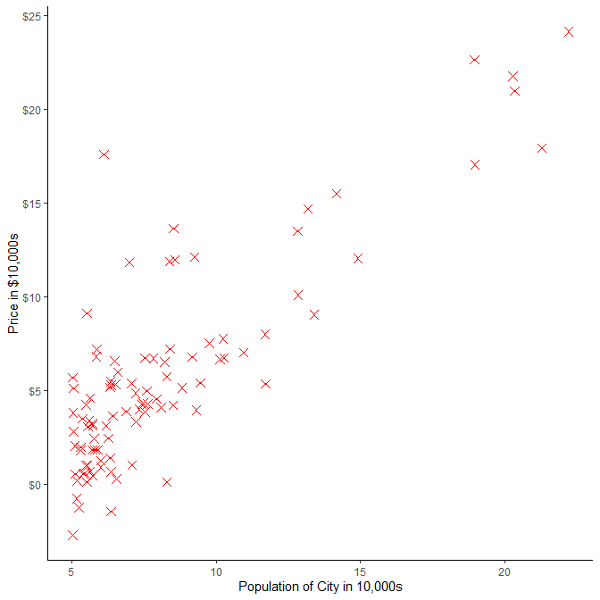

<style type="text/css">

body, td {
   font-size: 14px;
}
code.r{
  font-size: 12px;
}
pre {
  font-size: 12px
}
</style>
<!--BEGIN:  Set the global options and load packages-->


******************************************************************************************


# Introduction

Welcome to my blog. If you are reading this, most likely you've heard or have taken an amizing course taught by **Andrew Ng** on *Machine Learning*. I had the privelege of taking this course in 2011 and was able to rely on the learnings from it for years to come. One thing I always wished for is that course was taught in **R** instead of *Octave/Matlab*, so I decided to do all the assignments in the course using **R**. 

>**Implementation Notes**  
> This document is aligned with the course assignments, therefore **NO** math deriviation.
**ML** code is wrapped into model format of **lm, glm** functions. You can supply dataframes directly with model specifications in the format: **y~x1+x2...**

I will make every effort to avoid using any packages other that **ggplot2**. Enjoy!

The **Github repository** for this blog can be found [here](https://github.com/kostya75/ML2020). 

# Week 2: Gradient Descent


Lets start with loading the housing data and food truck profit data from the **ex1**. Note that the data is loaded into a dataframe and not into individual X and y matricies.


```r
  df_prices<-read.csv("w2/ex1data2.txt",header = FALSE)
  names(df_prices)<-c("footage","bedroom","price")
  
  df_foodTruck<-read.csv("w2/ex1data1.txt",header = FALSE)
  names(df_foodTruck)<-c("X","y")
```

## Plotting Data
Next, let's visualize the data and examine the relationship between population of a city and profit of a food truck in that city: 


```r
ggplot(data=df_foodTruck)+geom_point((aes(x=X,y=y)),shape=4,color="red",size=3)+
  scale_y_continuous(labels = scales::dollar)+
  scale_x_continuous(labels = scales::comma)+
  labs(x="Population of City in 10,000s", y="Price in $10,000s")+
  theme(panel.background = element_blank(),axis.line = element_line(colour = "black"))
```



## Computing the cost J($\theta$)

**In this section we will examine implementation of the cost function:**

```r
computeCost<-function(X, y, theta){
  m<-dim(X)[1]
  J<-(1/(2*m))*t(X%*%theta-y)%*%(X%*%theta-y)
}
```

**Do the testing:**

```r
X<-as.matrix(cbind(rep(1,nrow(df_foodTruck)),df_foodTruck[,c("X")]))
y<-as.matrix(df_foodTruck["y"])

J<-computeCost(X, y, theta=c(0,0))

sprintf("Computed value of cost function = %s. Expected cost value (approx) 32.07",
       round(J,digits=2))
```

```
## [1] "Computed value of cost function = 32.07. Expected cost value (approx) 32.07"
```

## Gradient descent

Next, we will implement gradient descent similar to the one in `gradientDescentMulti.m`. The function below has the following inputs:

- `X,y` data in matrix format
- `theta` initial value for $\theta$  
- `alpha` the learning rate $\alpha$  
- `num_iters` how many iterations the loop should make  
- `threshold` break execution if difference in J($\theta$) from one iteration to another reached a value below threshold  

The function outputs a list that has 2 elements:

- `theta` parameter vector  
- `iteration` how many iterations it took to converge  


```r
gradientDescentMulti<-function(X, y, theta, alpha, num_iters,threshold){
  J_history<-vector(mode = "numeric", length = num_iters)
  m<-nrow(X)
  for(i in seq_len(num_iters)){
    theta<-theta-(t(X)%*%(X%*%theta-y))*(alpha/m)
    J_history[i]<-computeCost(X, y, theta)
    
    Conversion<-( i>1 &&  abs(1-(J_history[i]/J_history[i-1]))<threshold)
    
    if(is.na(Conversion)==F){
      if(Conversion) break
    } else  {
      stop(sprintf("Failed to converge. Learning rate alpha = '%s' is too large.",
                   alpha), domain = NA)
    }
  }
  out<-list(theta=theta,iteration=i)
}
```

**Testing:** Check the results of **Gradient Descent** against built-in **lm** function

```r
theta_GD<-gradientDescentMulti(X,y,theta=c(0,0),alpha=.02,num_iters = 10000,threshold=5e-11)$theta
theta_LM<-lm(y~X,data=df_foodTruck)$coef

#Compare to Linear regression
t(theta_GD)
```

```
##      [,1]     [,2]
## y -3.8952 1.192975
```

```r
theta_LM
```

```
## (Intercept)           X 
##   -3.895781    1.193034
```

## Feature Normalization

In this part we will look at housing prices dataset df_prices. More specifically, variables that will be part of X matrix: footage and bedroom:

```r
summary(df_prices[c("footage","bedroom")])
```

```
##     footage        bedroom    
##  Min.   : 852   Min.   :1.00  
##  1st Qu.:1432   1st Qu.:3.00  
##  Median :1888   Median :3.00  
##  Mean   :2001   Mean   :3.17  
##  3rd Qu.:2269   3rd Qu.:4.00  
##  Max.   :4478   Max.   :5.00
```

Values of feature `bedroom` are about 1,000 smaller than the values of `footage`. Performing feature scaling will insure that gradient descent converges much quicker  
The function `featureNormalize` takes the following inputs:

- `xm` matrix of X's  
- `infl` scalar, 1 if intercept is present in the model, 0 otherwise  

The function outputs a list that has 2 elements:

- `x` matrix of standartized X's
- `scalingMatrix` matrix of means and st. deviations for each regressor. If `infl=1`, mean is set to 0 and st. dev=1 for the first column in X's


```r
featureNormalize<-function(xm, infl){
  
  scalingMatrix<-apply(xm,2,function(x){
    cbind(mean(x),sd(x))
  })
  rownames(scalingMatrix)<-c("mu","sigma")
  
  # if model has constant, do not scale the constant
  if(infl==1){
    scalingMatrix[1,1]<-0
    scalingMatrix[2,1]<-1
  }

  mus<-scalingMatrix[rep(1,nrow(xm)),]
  sds<-scalingMatrix[rep(2,nrow(xm)),]
  X_norm<-(xm-mus)/sds
  out<-list(x=X_norm,scalingMatrix=scalingMatrix)
}
```

**Testing:** Compare original matrix of X's to Feature Normalized

```r
normalize<-featureNormalize(
  xm=as.matrix(df_prices[c("footage","bedroom")]),
  infl=0
  )

normalize$scalingMatrix
```

```
##         footage   bedroom
## mu    2000.6809 3.1702128
## sigma  794.7024 0.7609819
```

```r
head(normalize$x)
```

```
##          footage    bedroom
## [1,]  0.13000987 -0.2236752
## [2,] -0.50418984 -0.2236752
## [3,]  0.50247636 -0.2236752
## [4,] -0.73572306 -1.5377669
## [5,]  1.25747602  1.0904165
## [6,] -0.01973173  1.0904165
```

```r
head(df_prices[c("footage","bedroom")])
```

```
##   footage bedroom
## 1    2104       3
## 2    1600       3
## 3    2400       3
## 4    1416       2
## 5    3000       4
## 6    1985       4
```

## Putting it all together: `gd` function

In this section I would like discuss a **"wrapper"** function ``gd`` that works with the functions above in a similar fashion as **lm** does with **lm.fit**. That is goal here is to make gradient descent a practical solution that could serve as an alternative to **lm**.  
The function ``gd`` takes the following inputs: 

- `formula` an object of class "formula": a symbolic descriptionof the model to be fitted  
- `data` data frame  
- `subset` an optional vector specifying a subset of observations to be used in the fitting process  
- `theta` a vector of initial values of $\theta$. Length of the vector should match model specification  
- `alpha` the learning rate $\alpha$  
- `num_iters` how many iterations the loop should make  
- `threshold` break execution if difference in J($\theta$) from one iteration to another reached a value below threshold  
- `normalize` logical. If `FALSE` the scaling matrix will have `mu=0` and `sd. dev=1` for all variables  

The function outputs a list that has 3 elements:

- `theta` parameter vector of model coefficients   
- `scalingMatrix` matrix of means and st. deviations for each regressor. If `infl=1`, mean is set to 0 and st. dev is set to 1 for the first column in X's
- `iteration` how many iterations it took to converge  
  


```r
gd<-function(formula,data,subset,theta,alpha=1e-4, num_iters=1e+4, threshold=5e-10, normalize=T){

  mf <- match.call(expand.dots = F)
  m <- match(c("formula", "data","subset"), 
             names(mf), 0L)
  mf <- mf[c(1L, m)]
  mf$drop.unused.levels <- TRUE
  mf[[1L]] <- quote(stats::model.frame)
  mf <- eval(mf, parent.frame())
  mt <- attr(mf, "terms")
  
  y <- model.response(mf, "numeric")
  x <- model.matrix(mt, mf)
  # flag if intercept was selected. will set lambda vector[1] (regularization variable) to zero if intercept present in formula
  infl <- attr(mt,"intercept")
  #
  n<-ncol(x)
  if(n!=length(theta)) stop("Model formula and initial theta have incompatible dimensions")
  #lm.fit (x, y)$coefficients
  scalingMatrix<-NULL
  if(normalize){
    x<-featureNormalize(x,infl=infl)$x
    scalingMatrix<-featureNormalize(x,infl=infl)$scalingMatrix
  }
  
  out<-gradientDescentMulti(X=x, y=y, theta=theta, alpha=alpha, num_iters=num_iters,threshold=threshold)
  model<-list(theta=out$theta, scalingMatrix=scalingMatrix, iteration=out$iteration)
}
```


