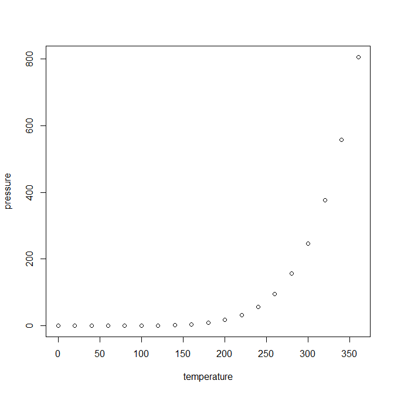

<!--BEGIN:  Set the global options and load packages-->

******************************************************************************************

# Introduction

Welcome to my blog. If you are reading this, most likely you've heard or have taken an amizing course taught by **Andrew Ng** on *Machine Learning*. I had the privelege of taking this course in 2011 and was able to rely on the learnings from it for years to come. One thing I always wished for is that course was taught in **R** instead of *Octave/Matlab*, so I decided to do all the assignments in the course using **R**.  

I will make every effort to avoid using any packages other that **ggplot2**. Enjoy!

The **Github repository** for this blog can be found [here](https://github.com/kostya75/ML2020). 

# Week 2: Gradient Descent

You can also embed plots, for example:

Note that the `echo = FALSE` parameter was added to the code chunk to prevent printing of the R code that generated the plot.
